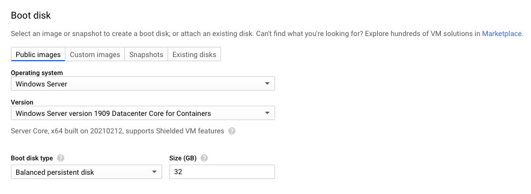

+++
title = "Kubernetes Windows Nodes"
description = "µsoft windows kubernetes playground"
date = "2021-02-28"
markup = "mmark"
+++

### Introduction

This post is a walkthrough on using a Windows node to run network policies with
agnhost:2.26 mappings in order to understand how suitable the netpol suite is ready for it.

https://github.com/kubernetes/kubernetes/tree/master/test/e2e/network/netpol

### Setting up the cluster



Our master needs to be on Linux, so a GCP Vm with COS is being used, following 
up the quickstart on this node:

https://docs.projectcalico.org/getting-started/kubernetes/quickstart

Start the cluster in the following subnet with Kubeadm:

```
sudo kubeadm init --pod-network-cidr=192.168.0.0/16
sudo cp -i /etc/kubernetes/admin.conf $HOME/.kube/config
sudo chown $(id -u):$(id -g) $HOME/.kube/config
```

Install Calico operator and CRDs:

```
kubectl create -f https://docs.projectcalico.org/manifests/tigera-operator.yaml
kubectl create -f https://docs.projectcalico.org/manifests/custom-resources.yaml
```

Check if the pods are running:

```
kubectl get pods -A
calico-system     calico-kube-controllers-6797d7cc89-xmvwv   1/1     Running   0          79m
calico-system     calico-node-hckk5                          1/1     Running   0          79m
calico-system     calico-typha-7f598c987d-x2l7m              1/1     Running   0          79m
kube-system       coredns-74ff55c5b-pwn6f                    1/1     Running   0          103m
kube-system       coredns-74ff55c5b-xhv7m                    1/1     Running   0          103m
kube-system       etcd-hackbox                               1/1     Running   0          103m
kube-system       kube-apiserver-hackbox                     1/1     Running   0          103m
kube-system       kube-controller-manager-hackbox            1/1     Running   0          103m
kube-system       kube-proxy-nvfj4                           1/1     Running   0          103m
kube-system       kube-scheduler-hackbox                     1/1     Running   0          103m
tigera-operator   tigera-operator-549bf46b5c-kw6ng           1/1     Running   0          79m
```

### Bringing up the Windows node


It's required to have at least:

* `Windows Server 1909 (AKA 19H2 build 18362.1049 or greater), with Docker service enabled`

So we are using the `windows-server-1909-dc-core-for-containers-v20210212` machine, connect with RDP:

So you will be able to run ommand as Administrator using powershell. Magically following the instructions 
on ProjectCalico tutorial will add the node on your cluster:

https://docs.projectcalico.org/getting-started/windows-calico/quickstart

```
calicoctl ipam configure --strictaffinity=true  # this is important
kubectl patch installation default --type=merge -p '{"spec": {"calicoNetwork": {"bgp": "Disabled"}}}'
```

Copy the config from the cluster to the windows machine (from ~/.kube/config), and run the installation

```
$  c:\install-calico-windows.ps1 -KubeVersion 1.20.1
C:\CalicoWindows\kubernetes\install-kube-services.ps1

Downloading CNI binaries
[DownloadFile] File c:\k\cni\host-local.exe already exists.
Downloading Windows Kubernetes scripts
[DownloadFile] File c:\k\hns.psm1 already exists.
[DownloadFile] File c:\k\InstallImages.ps1 already exists.
[DownloadFile] File c:\k\Dockerfile already exists.
WARNING: The names of some imported commands from the module 'hns' include unapproved verbs that might make them less
discoverable. To find the commands with unapproved verbs, run the Import-Module command again with the Verbose
parameter. For a list of approved verbs, type Get-Verb.
Downloaded [https://dl.k8s.io/v1.20.4/kubernetes-node-windows-amd64.tar.gz] => [C:\Users\amim_knabben\AppData\Local\Temp\2\tmp7111.tar.gz]
...
* Starting Calico...
This may take several seconds if the vSwitch needs to be created.
Waiting for Calico initialisation to finish...
Waiting for Calico initialisation to finish...StoredLastBootTime , CurrentLastBootTime 20210301012833.499350+000
 ```
 
#### Check the node is ready

```
NAME                                           STATUS   ROLES                  AGE   VERSION
devbox                                         Ready    control-plane,master   23h   v1.20.1
windows-1.us-east1-b.c.kflow-294915.internal   Ready    <none>                 21h   v1.20.4
```

** Found some DNS ISSUES, didn't waste much time on it. **

### Trying Calico on EKS 

Instead, give another try using EKS as the following guide exemplifies: 

https://github.com/tigera-solutions/install-calico-for-windows

A few comments here, default Network Policy does not works as `amiFamily: WindowsServer2019FullContainer`, check the correct
AMI set below. The simpler method is to go without EKS and eksctl managed hosts:

https://aws.amazon.com/blogs/containers/open-source-calico-for-windows-containers-on-amazon-eks/

This Calico version CNI on v1.7.8 works fine

https://raw.githubusercontent.com/aws/amazon-vpc-cni-k8s/c1658d5c5d401ad271c4fe6c8fbd96ba4a01d638/config/v1.7/calico.yaml

Just make sure you have the correct architecture binary from:

* `curl -LO https://dl.k8s.io/release/v1.20.0/bin/windows/amd64/kubectl.exe`

### Initial netpol on Win

The nodeSelector with `windows` needs to be explicit in the pod creation:

 
  thePod := pod.KubePod()
  thePod.Spec.NodeSelector = map[string]string{
      "kubernetes.io/os": "windows",
  }


Otherwise this the Pod will be on Pending status with:

* `pod does not have label vpc.amazonaws.com/PrivateIPv4Address`

Some other examples on Windows:
https://docs.projectcalico.org/getting-started/windows-calico/demo

If you wanna dig deeper in the topic:

TGIK 144 - Exploring the State of K8s on Windows
https://www.youtube.com/watch?v=WnXnO97tsNo
