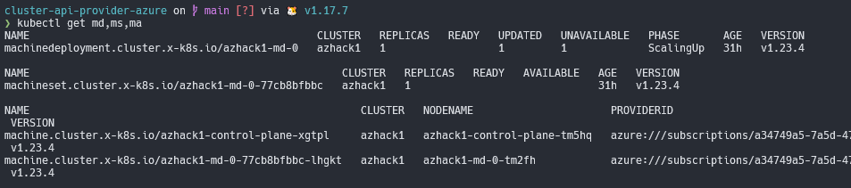
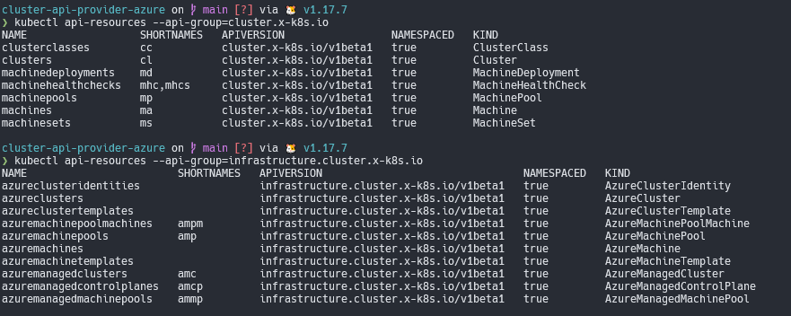
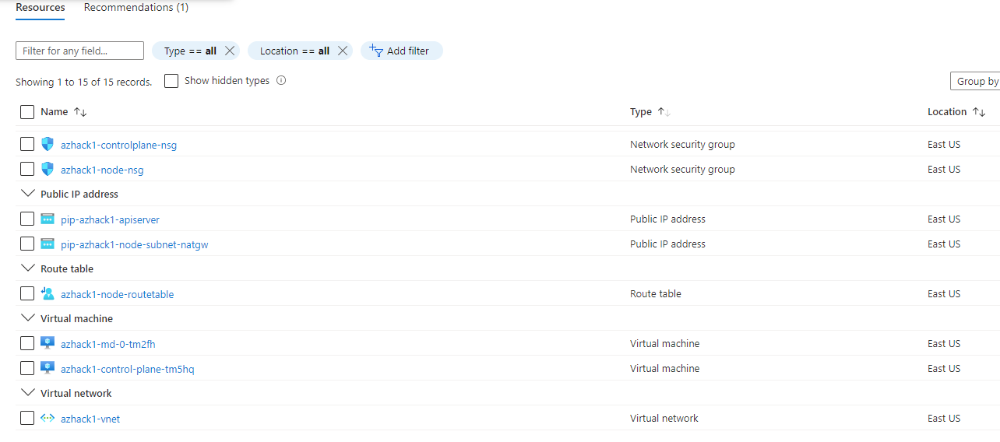
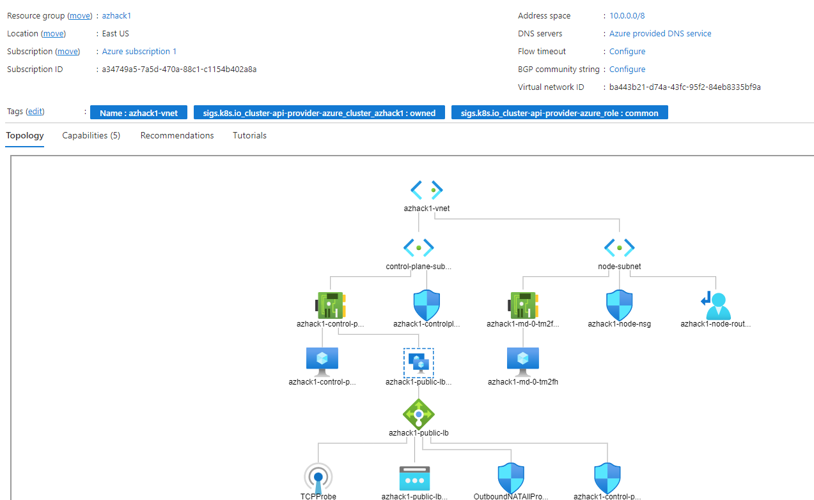
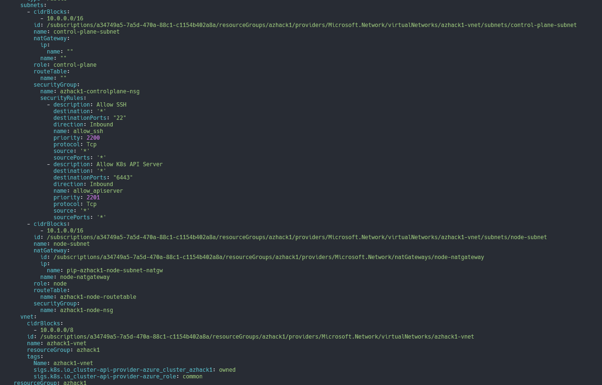

+++
title = "Cluster API Provider for Azure"
description = "Diagram and CRDs for CAPZ"
date = "2022-03-20"
markup = "mmark"
+++

## Introduction

From the official [documentation](https://capz.sigs.k8s.io/) we have the original definition of Cluster API, it brings a declarative, 
Kubernetes-style APIs to cluster creation, configuration and management. The API itself is shared across multiple 
cloud providers allowing for true Azure hybrid deployments of Kubernetes.

## Target Cluster Diagram

This cluster was generated using the ` make create-workload-cluster` from the CAPZ repository.

The diagram describes the [CRDs](https://cluster-api.sigs.k8s.io/developer/crd-relationships.html) and objects created related to this Workload cluster inside Azure.


It's possible to list the objects inside the management cluster.



List the resources from both the Cluster API and Azure provider groups.



## Separation of concerns

CAPZ will manage through the controllers the assets created inside Azure. First is created a Resource Group with
your cluster name on it.



### Networking

Looking the vNET and subnets created on it.



As seen on [CAPZ docs](https://capz.sigs.k8s.io/topics/custom-vnet.html#pre-existing-vnet-and-subnets). When providing a vnet, it is required to also provide the two subnets that should be used for control planes and nodes.

The control-plane (apiserver) is accessible externally by a public IP load balancer by default, it's required a few tweaks to
make it private!



On the target node, check the nodes IPs, they MUST match the ones in the vnet subnets, NotReady because the cluster 
has no CNI installed by default!

```shell
❯ kubectl get nodes -o wide
NAME                          STATUS     ROLES                  AGE   VERSION   INTERNAL-IP   EXTERNAL-IP   OS-IMAGE             KERNEL-VERSION      CONTAINER-RUNTIME
azhack1-control-plane-tm5hq   NotReady   control-plane,master   31h   v1.23.4   10.0.0.4      <none>        Ubuntu 20.04.3 LTS   5.11.0-1028-azure   containerd://1.6.0
azhack1-md-0-tm2fh            NotReady   <none>                 31h   v1.23.4   10.1.0.4      <none>        Ubuntu 20.04.3 LTS   5.11.0-1028-azure   containerd://1.6.0
```

### Scaling the VMs

The machine deployments works the same way as a Deployment object on the `scale` usage. New VMs are being (de)allocated
when scaled.

```
❯ kubectl scale machinedeployment azhack1-md-0 --replicas=3
machinedeployment.cluster.x-k8s.io/azhack1-md-0 scaled

❯ kubectl get machines
NAME                            CLUSTER   NODENAME                      PROVIDERID                                                                                                                                                   PHASE     AGE   VERSION
azhack1-control-plane-xgtpl     azhack1   azhack1-control-plane-tm5hq   azure:///subscriptions/a34749a5-7a5d-470a-88c1-c1154b402a8a/resourceGroups/azhack1/providers/Microsoft.Compute/virtualMachines/azhack1-control-plane-tm5hq   Running   31h   v1.23.4
azhack1-md-0-77cb8bfbbc-bczmw   azhack1                                                                                                                                                                                              pending   12s   v1.23.4
azhack1-md-0-77cb8bfbbc-lhgkt   azhack1   azhack1-md-0-tm2fh            azure:///subscriptions/a34749a5-7a5d-470a-88c1-c1154b402a8a/resourceGroups/azhack1/providers/Microsoft.Compute/virtualMachines/azhack1-md-0-tm2fh            Running   31h   v1.23.4
azhack1-md-0-77cb8bfbbc-zmrc5   azhack1                                                                                                                                                                                              pending   12s   v1.23.4
```
