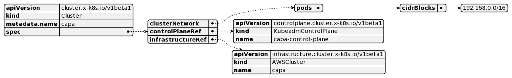

+++
title = "Hybrid nodes with ClusterClass on Amazon Web Service"
description = "still breaking things on saturday night"
date = "2022-07-30"
markup = "mmark"
+++

## Introduction

This post will be quick one to show how build a hybrid cluster using ClusterClass.

The idea behind ClusterClass is simple: define the shape of your cluster once, and reuse it many times,
abstracting the complexities and the internals of a Kubernetes cluster [away](.https://kubernetes.io/blog/2021/10/08/capi-clusterclass-and-managed-topologies/).

From the original CAEP: Cluster API does not expose a native way to provision multiple clusters of the same configuration. 
The ClusterClass object is supposed to act as a collection of template references which can be used to create managed topologies.
Today, the Cluster object is a logical grouping of components which describe an underlying cluster. 
The user experience to create a cluster requires the user to create a bunch of underlying resources such as KCP 
(control plane provider), MachineDeployments, and infrastructure or bootstrap templates for those resources which 
logically end up representing the cluster. Since the cluster configuration is spread around multiple components, upgrading 
the cluster version is hard as it requires changes to different fields in different resources to perform an upgrade. 
The ClusterClass object aims at reducing this complexity by delegating the responsibility of lifecycle managing 
these underlying resources to the Cluster controller.

## Shaping the cluster

### Regular CAPI spec

In the normal spec you define a Cluster and AWSCluster objects.



The KCP points to the infrastructure being it an AWSMachineTemplate and definitions of the join.


The last piece and it's kind of detached from the cluster are the machinedeployments, what here
can be created as different objects, and the node-pool is lost when translate for the cli.


One other bad issue, is the lack of reuse of these MD objects on different clusters.

### ClusterClass CAPI spec

Looking the objects modeling it's very clear how beneficial these setups can be.

The ClusterClass object allow you to define a workers with a few machineDeployments specs,
meaning a CC can have as many MD definitions as you want, and as you can see not necessary
be used on your cluster.


Managed topologies let you start the ClusterClass, so it's possible to have as many cluster with the similar
topology using a few reusable templates.


NOTE: The API is still in alpha.


### Generating the spec 

Right now clusterctl generate yaml can be used with a few templates available, you can pass the values
as environment variables and envsubst will replace the values there.

```shell
$ CLUSTER_NAME=capa \
CNI_RESOURCES=cni \
CONTROL_PLANE_MACHINE_COUNT=1 \
KUBERNETES_VERSION=1.22.10 \
WORKER_MACHINE_COUNT=1 
clusterctl generate yaml \
--from https://github.com/kubernetes-sigs/cluster-api-provider-aws/blob/main/templates/cluster-template-simple-clusterclass.yaml > cluster.yaml

$ kubectl apply -f cluster.yaml
```

Inside the specs you start with the Cluster object that is defined as follows, 
topology has a class (ClusterClass reference), a controlPlane and worker fields.

```yaml
apiVersion: cluster.x-k8s.io/v1beta1
kind: Cluster
metadata:
  name: capa
spec:
  clusterNetwork:
    pods:
      cidrBlocks:
      - 192.168.0.0/16
  topology:
    class: quick-start
    controlPlane:
      replicas: 1
    version: 1.22.10
    workers:
      machineDeployments:
      - class: default-worker
        name: md-0
        replicas: 1
```

The CC definition is a little longer and as you can see follows the same controlPlane, infrastructure and
workers references for templates.

```yaml
apiVersion: cluster.x-k8s.io/v1beta1
kind: ClusterClass
metadata:
  name: quick-start
spec:
  controlPlane:
    machineInfrastructure:
      ref:
        kind: AWSMachineTemplate
    ref:
      kind: KubeadmControlPlaneTemplate
  infrastructure:
    ref:
      kind: AWSClusterTemplate
  workers:
    machineDeployments:
    - class: default-worker
      template:
        bootstrap:
          ref:
            kind: KubeadmConfigTemplate
        infrastructure:
          ref:
            kind: AWSMachineTemplate
```

It's possible to dry run the objects that are going to be created or modified, the output 

```shell
$ clusterctl alpha topology plan -f cluster.yaml -o out
...
Changes for Cluster "default/capa":

  NAMESPACE  KIND                   NAME                       ACTION
  default    AWSCluster             capa-9p2lh                 created
  default    AWSMachineTemplate     capa-control-plane-p8xvx   created
  default    AWSMachineTemplate     capa-md-0-infra-n7nm7      created
  default    KubeadmConfigTemplate  capa-md-0-bootstrap-92gp5  created
  default    KubeadmControlPlane    capa-wlc2n                 created
  default    MachineDeployment      capa-md-0-8k6c8            created
  default    Secret                 capa-shim                  created
  default    Cluster                capa                       modified
```

#### Variables and patches

When these specs are generated you can find a few variables in the cluster [here](https://cluster-api.sigs.k8s.io/tasks/experimental-features/cluster-class/write-clusterclass.html#clusterclass-with-patches).
The variable can then be used in a patch to set a field on a template referenced in the ClusterClass. 
The selector specifies on which template the patch should be applied. jsonPatches specifies which JSON patches should 
be applied to that template. 

In this case we set the `spec.template.spec.region` field of the AWSClusterTemplate to the value of the variable `region`.

```yaml
  # cluster.yaml
  variables:
  - name: region
    value: us-east-1
    
  # cluster-class.yaml
  patches:
  - definitions:
      - jsonPatches:
          - op: add
            path: /spec/template/spec/region
            valueFrom:
              variable: region
        selector:
          apiVersion: infrastructure.cluster.x-k8s.io/v1beta1
          kind: AWSClusterTemplate
          matchResources:
            infrastructureCluster: true
    name: region
```

#### Install the CNI

The CNI can be installed via ClusterResourceSet, as the template generated, in this example I installed
manually.

```shell
$ clusterctl get kubeconfig capa > capa.config
kubectl --kubeconfig=capa.config apply -f https://docs.projectcalico.org/v3.21/manifests/calico.yaml
```

Now you are running a full unmanaged AWS workload cluster setup in less than 5 minutes.

### Conclusion

The evolution of the CAPI project and providers are impressive, as [noted](https://www.youtube.com/watch?v=KzYV-fJ_wH0) things are only starting, and 
features like CC brings more powerful to these controllers. Multi cloud centric management is a must on 2022,
CAPI is one of the projects that definitely will help on it.

If you want to learn more about the feature watch the [TGIK 178: ClusterAPI - ClusterClass & Managed Topologies](https://www.youtube.com/watch?v=U9CDND0nzRI)

If you are interested on multi-OS in general check out this [Antrea Live](https://www.youtube.com/watch?v=Z_1dI-yR_Fw) and send a DM.
