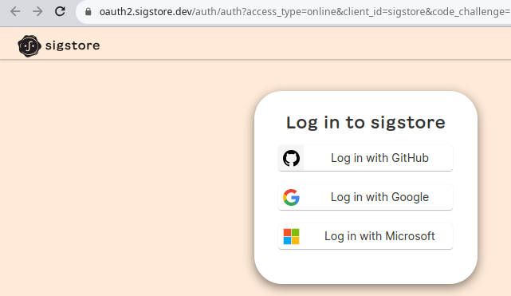

+++
title = "sigstore policy-controller validation"
description = "Enforce keyless signing and attestation verification on OCI images."
date = "2023-08-01"
+++

## Introduction

Software developers can securely sign software artifacts with the sigstore toolkit
the signing can range from blobs to OCI images and SBOM with attestations. This post
will go through a live usage of these tools and examplification in a pragmatic
way how to use and what problem they solve.

## sigstore architecture

Sigstore claims to be the Lets Encrypt of the supply chain, making it easy to fix some
known issues in the software provenance [this presentation](https://www.youtube.com/watch?v=G7gU3WZTBpk) brings
a few ideas around the digital signature challenge on integrity, authenticity and non-repudiation. Highlighing 
the key distribution and key compromising. 

To solve it the sigstore toolkit simplifies the signing interface allowing transparency, integrity and assurance.
Sigstore can eliminate the key management problem by using ephemeral keys.

Accordingly [the author](https://www.amazon.com/Software-Transparency-Security-Software-Driven-Society/dp/1394158483/)
*code provenance* is the ability to have a chain of custody showing where code originated and from whom.

A few key tools exists for it to exists to support the project:

1. *Fulcio* - is the Root CA focused on code signing. Issues certifications binded with OIDC, using developer identity.
1. *Cosign* -tools for signing/verifying containers 
1. *Rekor* - an immutable, append-only transparency ledge, so that signing events can be publicly audited.
1. *Policy Controller* - admission controller used to enforce policy on a Kubernetes cluster based on cosign metadata.


sequenceDiagram;
    autonumber

    participant admin

    participant cosign
    participant fulcio
    participant rekor

    participant polctrl
    
    admin->>cosign: signs an artifact using using OIDC
    cosign-->>fulcio: requests a certificate
    fulcio->>fulcio: issue a short-lived certificate
    fulcio->>rekor: persist the artifact digest, sig, and cert
    polctrl->>fulcio: validate signature and attestation



## [Signing and validation](https://docs.sigstore.dev/security/)

Fulcio was designed to avoid revocation by issuing the short-lived certificates
instead. When validating the signature, the policy controller only needs to know that the artifact 
was signed while the certificate was valid.

Policy controller can leverage Fulcio's short-lived code signing certificates and
Rekor's transparency log to confirm that an atifact was signed while the
certificate was valid. When a signature is stored in the log, the associated
entry is included into the log with a signed timestamp, it can request the entry
cryptographically verify the timestamp is correct, and verify that an artifact was signed
while the certifacte was valid.

### Installing the policy-controller

To install the policy-controller via Helm

```shell
helm repo add sigstore https://sigstore.github.io/helm-charts
helm repo update
kubectl create namespace cosign-system
helm install policy-controller -n cosign-system sigstore/policy-controller --devel
```

Create a new namespace and apply the policy verification via admission webhook:

```shell
kubectl create namespace secure
kubectl label namespace secure policy.sigstore.dev/include=true
```

### Signing the OCI image

First step is to sign the OCI image, in this case I'm doing a copy of an external container to
a registry it's possible to write

```shell
docker tag nicolaka/netshoot:latest knabben/netshoot:latest
docker push knabben/netshoot:latest
```

CI can use SPIFFE id for signing, or a regular dev can use OICD authentication, with cosign:



```shell
❯ cosign sign -a real=true knabben/netshoot:latest
Generating ephemeral keys...
Retrieving signed certificate...

        The sigstore service, hosted by sigstore a Series of LF Projects, LLC, is provided pursuant to the Hosted Project Tools Terms of Use, available at https://lfprojects.org/policies/hosted-project-tools-terms-of-use/.
        Note that if your submission includes personal data associated with this signed artifact, it will be part of an immutable record.
        This may include the email address associated with the account with which you authenticate your contractual Agreement.
        This information will be used for signing this artifact and will be stored in public transparency logs and cannot be removed later, and is subject to the Immutable Record notice at https://lfprojects.org/policies/hosted-project-tools-immutable-records/.

By typing 'y', you attest that (1) you are not submitting the personal data of any other person; and (2) you understand and agree to the statement and the Agreement terms at the URLs listed above.
Are you sure you would like to continue? [y/N] y
Your browser will now be opened to:

https://oauth2.sigstore.dev/auth/auth?access_type=online&client_id=sigstore&code_challenge=...

Successfully verified SCT...
WARNING: Image reference knabben/netshoot:latest uses a tag, not a digest, to identify the image to sign.
    This can lead you to sign a different image than the intended one. Please use a
    digest (example.com/ubuntu@sha256:abc123...) rather than tag
    (example.com/ubuntu:latest) for the input to cosign. The ability to refer to
    images by tag will be removed in a future release.

tlog entry created with index: 29686804
Pushing signature to: index.docker.io/knabben/netshoot
```

After authenticating in the web browser, the signature is pushed its possible to use the certificate
property to manually validate it:

```shell
❯ cosign verify knabben/netshoot --certificate-identity=user@gmail.com --certificate-oidc-issuer=https://accounts.google.com | jq .

[
  {
    "critical": {
      "identity": {
        "docker-reference": "index.docker.io/knabben/netshoot"
      },
      "image": {
        "docker-manifest-digest": "sha256:d845da1645d514a0ddf3ee1fe4df9a2cdae4d0f1f45dc9d16a34cf253366cb71"
      },
      "type": "cosign container image signature"
    },
    "optional": {
      "1.3.6.1.4.1.57264.1.1": "https://accounts.google.com",
      "Bundle": {
        "SignedEntryTimestamp": "...",
        "Payload": {
          "body": "...",
          "integratedTime": 12345,
          "logIndex": 12345,
          "logID": "..."
        }
      },
      "Issuer": "https://accounts.google.com",
      "Subject": "user@gmail.com",
      "real": "true"
    }
  }
]
```

Use `$ crane manifest $(cosign triangulate $IMAGE) | jq .` to learn about the layers and bundle 
stored in the image.

#### Using a static policy

It can work more like an ACL for starting the images with `pass` || `fail` settings:
 
```yaml
apiVersion: policy.sigstore.dev/v1beta1
kind: ClusterImagePolicy
metadata:
  name: image-policy
spec:
  images:
  - glob: "index.docker.io/knabben/**"
  authorities:
  - static:
      action: pass
```

Run the netshoot image

```shell
kubectl run netshoot --image=docker.io/knabben/netshoot
pod/netshoot created
```

Try to run the official not signed one and get the webhook denying it:

```shell
❯ kubectl run netshoot --image=docker.io/nicolaka/netshoot
Error from server (BadRequest): admission webhook "policy.sigstore.dev" denied the request: validation failed: no matching policies: spec.containers[0].image
index.docker.io/nicolaka/netshoot@sha256:a7c92e1a2fb9287576a16e107166fee7f9925e15d2c1a683dbb1f4370ba9bfe8
```

#### Using keyless authority

Its possible to add a keyless authentication against the default Fulcio server for example:

```shell
apiVersion: policy.sigstore.dev/v1beta1
kind: ClusterImagePolicy
metadata:
  name: image-policy
spec:
  images:
  - glob: "index.docker.io/knabben/**"
  authorities:
  - keyless:
      identities:
      - issuer: https://accounts.google.com
        subject: amim.knabben@gmail.com
```

The same deny apply when the container is not signed

```
❯ kubectl run httpbin --image=docker.io/knabben/test
Error from server (BadRequest): admission webhook "policy.sigstore.dev" denied the request: validation failed: failed policy: image-policy: spec.containers[0].image
index.docker.io/knabben/test@sha256:e72dc35fb44df0b22e7ff622b7f702de7534d573767723aaa89ee6db2cb8ac78 signature keyless validation failed for authority authority-0 for index.docker.io/knabben/test@sha256:e72dc35fb44df0b22e7ff622b7f702de7534d573767723aaa89ee6db2cb8ac78: no signatures found for image
```

