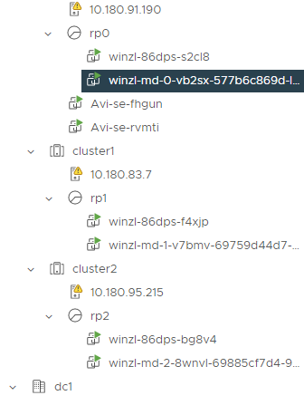

+++
title = "Multi AZ on Kubernetes and vSphere"
description = "Detail Windows clusters on Tanzu Kubernetes Grid vSphere with Multi-AZ support"
date = "2023-03-22"
markup = "mmark"
+++

## Introduction

Multi-AZ is a concept very well known on public clouds, its a technique used to provide high availability for services. On AWS they are distinct locations within an AWS region that re engineered to be isolated from failures in other AZ. On vSphere and on-premises, the datacenter is normally on one building only, and the AZ can be defined by server racks instead for exmaple. On this blog post I will cover a few notes on how to use ClusterAPI vSphere and setup a Kubernetes cluster on a segmented infrastructure on vCenter.

## Initial concepts

To provide integration with the underlying infrastructure, Kubernetes implements the Cloud Provider Interface, it decouple the Controller manager 
control loops regarding the infra, a few interfaces that can be implemented in the CPI are Node, route, service and custom control loops. 
The CPI can also apply zones and region labels to the nodes. It can be enabled by tagging VMs on vSphere with the desired labels. 
You can check the spread on [node labels](https://github.com/kubernetes/cloud-provider-vsphere/blob/master/docs/book/cloud_provider_interface.md#node-zonesregions-topology) `failure-domain.kubernetes.io/zone` and `failure-domain.kubernetes.io/region`

Accordingly to the ClusterAPI vSphere failure domain proposal, vSphere DOES NOT support native region/zone concept, 
to utilize the k8s failure domain feature which relies on nodes with region/zones labels, vsphere CPI added support for region/zone 
deployment options, using tags to configure the topology. It gives users full flexibility to configure arbitrary region and [zone definitions](https://github.com/kubernetes-sigs/cluster-api-provider-vsphere/blob/main/docs/proposal/20201103-failure-domain.md)

### Practice

For this example we going to spread the nodes across multiple compute clusters in the same Datacenter, this diagram was taken from the [CPI website](https://cloud-provider-vsphere.sigs.k8s.io/tutorials/deploying_cpi_with_multi_dc_vc_aka_zones.html).


Create 2 categories called k8s-zone and k8s-region, clusters must be tagged as zones and your DC is tagged as region, on this example the region `us-east-1`, has 3 zones:

```shell

$ govc tags.attach -c k8s-region us-east-1 /dc0

$ govc tags.attach -c k8s-zone us-east-1a /dc0/host/cluster0
$ govc tags.attach -c k8s-zone us-east-1b /dc0/host/cluster1
$ govc tags.attach -c k8s-zone us-east-1c /dc0/host/cluster2
```

Create 3 clusters in the datacenter and add a resourcePool on each, make sure DRS is enabled for the constraint update.


### Running with failure domain

Create the failure domain and zone deployment objects like the example for all 3 zones:

```yaml
apiVersion: infrastructure.cluster.x-k8s.io/v1beta1
kind: VSphereFailureDomain
metadata:
 name: us-east-1a
spec:
 region:
   name: us-east-1
   type: Datacenter
   tagCategory: k8s-region
 zone:
   name: us-east-1a
   type: ComputeCluster
   tagCategory: k8s-zone
 topology:
   datacenter: dc0
   computeCluster: cluster0
   datastore: sharedVmfs-0
   networks:
   - VM Network
---
apiVersion: infrastructure.cluster.x-k8s.io/v1beta1
kind: VSphereDeploymentZone
metadata:
 name: us-east-1a
spec:
 server: 10.180.0.1
 failureDomain: us-east-1a
 placementConstraint:
   folder: folder0
   resourcePool: rp0
```

Make sure your Cluster object machine deployment has the correct `failureDomain` set.

```yaml
    workers:
      machineDeployments:
      - class: windows
        failureDomain: us-east-1a
        name: md-0
        replicas: 1
      - class: windows
        failureDomain: us-east-1b
        name: md-1
        replicas: 1
      - class: worker
        failureDomain: us-east-1c
        name: md-2
        replicas: 1
```

### Creating the cluster

You will get some balanced node spread across the vSphere clusters like, this applies for both workloads and control planen nodes.



