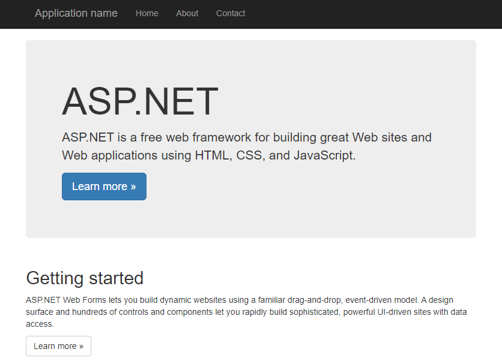

+++
title = "Windows Containers and .NET apps"
description = "How to run Windows workload"
date = "2023-03-30"
markup = "mmark"
+++


## Introduction

That's a common question, what kind of workloads can you run on Windows clusters? In this post we are going to check the possibilities and how to build and run these services on a Windows cluster. There's a plenty of examples on all languages and build process spread over the Internet. This document intends to enumerate and list them for a quick review and reference. 

To do your choice a few topics that can compare both technologies. [Use](https://learn.microsoft.com/en-us/dotnet/standard/choosing-core-framework-server) .NET for your server application when:

* You have cross-platform needs.
* You're targeting microservices.
* You're using Docker containers.
* You need high-performance and scalable systems.
* You need side-by-side .NET versions per application.

Use .NET Framework for your server application when:

* Your app currently uses .NET Framework (recommendation is to extend instead of migrating).
* Your app uses third-party libraries or NuGet packages not available for .NET.
* Your app uses .NET Framework technologies that aren't available for .NET.
* Your app uses a platform that doesn't support .NET.

### .NET framework

MS announced .NET in 2000, being the platform for Windows API development. In this architecture at the time .NET framework was the first platform for development, the last released version is 4.8 and the project was discontinued in 2022. The most common case of usage is to run your current application that was no migrated aka legacy workloads. A few technologies like ASP.NET Web Forms Applications are supported only in .NET framework.

Apps are written in C#, F# or Visual Basic and compiled for Common Intermediary Language (CIL). The main resources are the Common Lanuage Runtime (CRL) and the .NET framework class library. The program only runs on Windows machines. Lets start with the [examples](https://hub.docker.com/_/microsoft-dotnet-framework-samples/). If you notice only the WindowsServerCore SDK and Runtime are available, meaning the final container OCI image will have 4Gb of size, so be patient in the downloading.

The first step is to build the image from a Dockerfile, check its split on 2 phase containers, the first part builds the binary with the SDK, the second one is responsible to run your ASP.NET application.

```yaml
FROM mcr.microsoft.com/dotnet/framework/sdk:4.8 AS build
WORKDIR /app

# copy csproj and restore as distinct layers
COPY *.sln .
COPY aspnetapp/*.csproj ./aspnetapp/
COPY aspnetapp/*.config ./aspnetapp/
RUN nuget restore

# copy everything else and build app
COPY aspnetapp/. ./aspnetapp/
WORKDIR /app/aspnetapp
RUN msbuild /p:Configuration=Release -r:False


FROM mcr.microsoft.com/dotnet/framework/aspnet:4.8 AS runtime
WORKDIR /inetpub/wwwroot
COPY --from=build /app/aspnetapp/. ./
```

First thing to notice is you need a Windows machine with Docker to build the image for windows/amd64 architecture, with these images I could not build using [buildx](https://fossies.org/linux/kubernetes/test/images/README.md#windows-test-images-considerations), 
but probably there's a way. Expose the service and port 8000:80 will be available for requests.

```yaml
apiVersion: apps/v1
kind: Deployment
metadata:
  name: aspdotnet
  labels:
    app: aspdotnet
spec:
  replicas: 1
  selector:
    matchLabels:
      app: aspdotnet
  template:
    metadata:
      labels:
        app: aspdotnet
    spec:
      nodeSelector:
        kubernetes.io/os: windows
      containers:
      - name: aspdotnet
        image: mcr.microsoft.com/dotnet/framework/samples:aspnetapp
        ports:
        - containerPort: 80
---
apiVersion: v1
kind: Service
metadata:
  name: aspdotnet
  labels:
    app: aspdotnet
spec:
  ports:
  - port: 8000
    targetPort: 80
  selector:
    app: aspdotnet
```



### .NET app

Its a free, cross-platform, open source developer platform for builiding many kinds of apps. Its divided in two parts:

* .NET SDK: Set of tools, libraries, and runtimes for development, building, and testing apps.
* .NET Runtimes: Set of runtimes and libraries, for running apps.

Again the SDK is used to build the image and the runtime to run your workload.
The steps are different though in the [sample](https://github.com/dotnet/dotnet-docker):

```yaml
FROM mcr.microsoft.com/dotnet/sdk:7.0 AS build
WORKDIR /source

# copy csproj and restore as distinct layers
COPY aspnetapp/*.csproj .
RUN dotnet restore --use-current-runtime

# copy everything else and build app
COPY aspnetapp/. .
RUN dotnet publish -c Release -o /app --use-current-runtime --self-contained false --no-restore

# final stage/image
FROM mcr.microsoft.com/dotnet/aspnet:7.0
WORKDIR /app
COPY --from=build /app .
ENTRYPOINT ["dotnet", "aspnetapp.dll"]
```

The `dotnet` CLI is available to build the project and run the final .dll. With the `SqlConnection` 
is possible to connect on a MSSQL server, the cool part is that it can run on [Windows](https://learn.microsoft.com/en-us/sql/linux/sql-server-linux-setup).


### Golang MSSQL

It's possible to compile a Golang app and run on Windows as well, you need two things:

1. Compile a Windows compatible PE32 binary with GOOS=windows GOARCH=amd64
2. and build a Windows compatible base image `FROM mcr.microsoft.com/windows/nanoserver:1809`

Copy the binary and run it. The one can test for example the connection to a MSSQL database with this example code:

```golang
func main() {
        // Build connection string
        connString := fmt.Sprintf("server=%s;user id=%s;password=%s;port=%d;database=%s;", server, user, password, port, database)
        var err error

        // Create connection pool
        db, err = sql.Open("mssql", connString)
        if err != nil {
                log.Fatal("Error creating connection pool: ", err.Error())
        }

        ctx, stop := context.WithCancel(context.Background())
        defer stop()

        appSignal := make(chan os.Signal, 3)
        signal.Notify(appSignal, os.Interrupt)

        go func() {
                <-appSignal
                stop()
        }()

        Ping(ctx)
}
```

## Conclusion

.NET workload is a very specialized one, and the framework is deprecated, still there's a lot of legacy workload and only Windows nodes can run it. 
For new apps is encouraged to use .NET or a more modern platform that can be used cross OS. 

