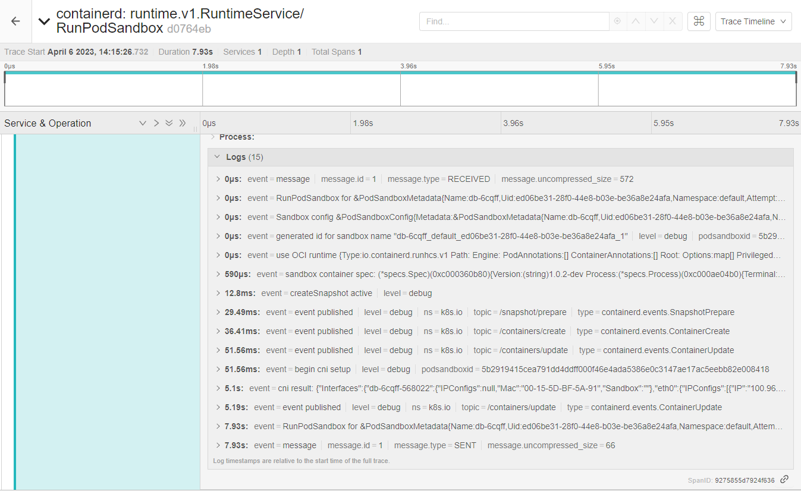

+++
title = "Windows CNI tracing and deep dive"
description = "Killer CNI Tracing"
date = "2023-04-06"
+++

## Introduction

I have spent some time debugging a very interesting issue that was noticed in one Windows cluster, the network initialization 
of this cluster was having a delay of a few seconds before the external world communication starts. This post will explain the steps
taken and the deep dive executed to find the root cause of the problem. A clear solution is not presented, but this can
post can guide on debuggability of similar issues.

### Containerd Tracing

First thing is to make sure there's Jaeger installed and accessible by the nodes of the cluster.
Take a look in the [Jaeger operator](https://www.jaegertracing.io/docs/1.43/operator/), it can be installed with a few specs apply in the cluster. You
will need an ingress controller to provide it an IP address and external access. For the jaeger-query and frontend, probably kubectl port-forward can do the trick. 
The second step is to configure ContainerD to send the samples directly to the agent. The containerd
section will need the tracing plugin and OpenTelemtry [configuration](https://github.com/containerd/containerd/blob/main/docs/tracing.md).

```yaml
root = "C:\\ProgramData\\containerd\\root"
state = "C:\\ProgramData\\containerd\\state"
version = 2

imports = ["C:\\Program Files\\\\containerd\\conf.d\\*.toml"]

[grpc]
  address = "\\\\.\\pipe\\containerd-containerd"

[plugins]

  [plugins."io.containerd.internal.v1.tracing"]
    sampling_ratio = 1.0
    service_name = "containerd"

  [plugins."io.containerd.tracing.processor.v1.otlp"]
    endpoint = "http://10.0.0.5:30841"

  [plugins."io.containerd.grpc.v1.cri"]
    sandbox_image = "projects-stg.registry.vmware.com/tkg/pause:3.8-windows-amd64"
    [plugins."io.containerd.grpc.v1.cri".cni]
      bin_dir = "C:/opt/cni/bin"
      conf_dir = "C:/etc/cni/net.d"
```

Notice the endpoint where I'm using a NodePort for the agent service. The last thing is to set
debug level in the containerd process so you can see more information in the trace. Other
interesting thing is to enable the logging in the service installed in the node.

```shell
sc.exe config containerd binPath="c:\Program Files\containerd\containerd.exe \
  --run-service --log-file=c:\tmp\containerd.log -l debug"
```

After a restarting the service, and creating the pod again, it possible to notice RunPodSandbox trace:



There're 2 interesting events, first `51.65ms` called `begin cni setup`, and 5 seconds later the result `cni result`.
Ok, it seems the issue is inside the CNI plugin used, the plugin for this CNI in particular talks with the agent 
via gRPC passing commands like `CmdAdd` and `CmdDel`, every time a pod is created or deleted.

### Debugging the CNI plugin

After deducing the error is in the CNI, I increased the log level of the agent that's receiving the request:


```shell
10:15:26.814722    3620 server.go:425] Received CmdAdd request cni_args:{container_id:"5b2919415cea791dd4ddff000f46e4ada5386e0c3147ae17ac5eebb82e008418" netns:"786877ce-0bdc-4ff7-a58a-0ba3a62b2a5d" ifname:"eth0" args:"K8S_POD_UID=ed06be31-28f0-44e8-b03e-be36a8e24afa;IgnoreUnknown=1;K8S_POD_NAMESPACE=default;K8S_POD_NAME=db-6cqff;K8S_POD_INFRA_CONTAINER_ID=5b2919415cea791dd4ddff000f46e4ada5386e0c3147ae17ac5eebb82e008418" path:"C:/opt/cni/bin" network_configuration:"{\"capabilities\":{\"dns\":true},\"cniVersion\":\"0.3.0\",\"ipam\":{\"type\":\"host-local\"},\"name\":\"cni\",\"runtimeConfig\":{\"dns\":{\"Servers\":[\"100.0.0.10\"],\"Searches\":[\"default.svc.cluster.local\",\"svc.cluster.local\",\"cluster.local\"],\"Options\":[\"ndots:5\"]}},\"type\":\"cni\"}"}
10:15:26.888326    3620 server.go:495] "Allocated IP addresses" container="5b2919415cea791dd4ddff000f46e4ada5386e0c3147ae17ac5eebb82e008418" result=&{Result:{CNIVersion:0.4.0 Interfaces:[] IPs:[{Version:4 Interface:<nil> Address:{IP:100.96.3.22 Mask:ffffff00} Gateway:100.96.3.1}] Routes:[] DNS:{Nameservers:[] Domain: Search:[] Options:[]}} VLANID:0}
10:15:26.889584    3620 server_windows.go:42] Got runtime DNS configuration: {[100.64.0.10]  [default.svc.cluster.local svc.cluster.local cluster.local] []}
10:15:26.891166    3620 interface_configuration_windows.go:136] Configuring IP address for container 5b2919415cea791dd4ddff000f46e4ada5386e0c3147ae17ac5eebb82e008418
10:15:29.386133    3620 pod_configuration_windows.go:97] Adding OVS port db-6cqff-568022 for container 5b2919415cea791dd4ddff000f46e4ada5386e0c3147ae17ac5eebb82e008418
10:15:30.354081    3620 agent.go:531] Deleting stale flows from previous round if any
10:15:30.354788    3620 agent.go:463] Persisting round number 12 to OVSDB
10:15:30.363033    3620 agent.go:468] Round number 12 was persisted to OVSDB
10:15:31.772203    3620 interface_configuration_windows.go:260] Send gratuitous ARP from container interface is not supported on Windows, return nil
10:15:31.772867    3620 pod_configuration.go:268] Configured interfaces for container 5b2919415cea791dd4ddff000f46e4ada5386e0c3147ae17ac5eebb82e008418
10:15:31.772867    3620 server.go:522] CmdAdd for container 5b2919415cea791dd4ddff000f46e4ada5386e0c3147ae17ac5eebb82e008418 succeeded
```

And start measuring how long the stack call was between them, if you notice we have around ~5 seconds of the event receive and the
complete success.


There some other process to find these bottlenecks like `go pprof` that can build a call tree and measure it.
Or its possible to add `klog.Info` statements between the calls and continue measuring them until you find the
bottleneck, when the pprof interface is not open.

Without detailing much about the issue in the CNI, was found that `Get-NetAdapter` calls were being used to
verify the existence of the Container interface, those direct powershell calls are very slow and costly.

## Conclusion

The usage of external command calls (mainly scripts) to execute tasks with the kernel can become a problem, powershell
is very complete and useful but it will slow down your application, this can be perceived when your service is under pressure.

Windows syscalls on Golang are available, the coverage of functionality can be lower or missing required information for
a particular data structure can [happen](https://golang.google.cn/pkg/syscall/?GOOS=windows&GOARCH=amd64), MS provides a good library HCMSHIM that covers a few Network and processing
[functionalities](https://github.com/microsoft/hcsshim).

In summary a higher level and faster API built-in on Golang could come by default, so the usage of powershell commandlets can be
replaced.
