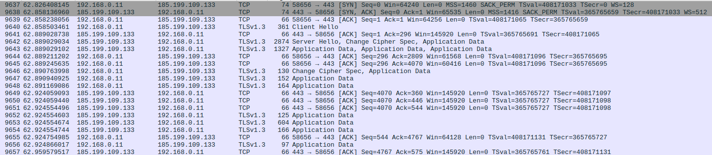

+++
title = "Secure gRPC services with mTLS"
description = "Hacking golang gRPC services and mTLS setup"
date = "2023-06-08"
+++

## Introduction

Authentication is part of the AAA (Authn, Authz, Audit) security framework, and a basic functionality for each
multi tenant modern system, the usage of gRPC as a channel of communication for east-west trafic allow the developer
to enable built-in mechanisms capable to not only secure the traffic via TLS encryption but to enable authentication
using SSL/TLS X.509 certificates.

This post will detail and demonstrate a client/server implementation that uses gRPC as a protocol of communication
and uses these TLS certificates for channels credentials.

The last part introduces `cert-manager` another CNCF project for PKI management inside Kubernetes clusters,
and its going to move the application to containers and use automatic generated certs instead.

## TLS and SSL

Starting with SSL (Secure Socket Layer), its a standard/deprecated technology used for establish an encrypted link
between server/clients, is 2015 it was deprecated in favor of TLS (now on 1.3) version.

[Demystifing Cryptography w/ OpenSSL 3.0](https://www.packtpub.com/product/demystifying-cryptography-with-openssl-30/9781800560345)
is a very good book in the topic and brings details in the difference of Symmetric cryptography ciphers used
for strong message digests, message authentication codes, and generating symmetric cryptograpic keys from password. On the
other hand there're asymmetric ciphers used to generate public/private encryption keys, digital signature, verification and 
x509, there'll be another subsection explaining how these ciphers are agreed, communicated and used in TLS.

### Public Key Infrastructure 

The goal of PKI (Public Key Infrastructure) is the management of public keys and digital certificates 
on a specific company infrastructure with the intent of identification and access management of the 
individuals on a secure network. 

The common components of this infrastructure are:

* Public/Private key pair
* Registration Authority
* Certificate Authority (CA)
* Certificate Store
* Certificate Revocation List (CRL)

Registration authority is defined as an entity responsible for one or more of the following
functions: the identification and authentication of the certificate participants. RA DO not
sign or issue certificates. Certificates here are data structures used for identify presentation and verification, X.509
are the format and the core for TLS-based protocols (including software signing and VPN)

The public key system relies on asymmetric cryptography, which consist of a public/private key pair. 
The CA certifies the ownership of the key pairs through the binding of the public key with the respective
identity of the entity. This binding is established thourgh a process of registration and inssuance of
certificates at an by the CA. When you sign your own certificate, the certificate is said to be self-signed.
self signed.

Browsers for example are developed with a built-in list of trusted roots 
(called certificate/trust store, operating systems and apps maintain their own list)
on a new request they iterate through all certificates in the path (chain of trust) starting with the trust
anchor, validating each certificate's basic information and critical extensions.

The Browsers verifies the certificate's integrity signature using public-key cryptography, it verifies the 
validity period time interval, and the Certificate Revocation Lists (CRL) periodically created by the CA.
Some other fields like the Issuer and Subject (DNS based) are checked.


### TLS Handshake


sequenceDiagram
    participant 192.168.0.11
    participant 185.199.109.133

    192.168.0.11->>185.199.109.133: ClientHello (cipher suite/extensions)
    185.199.109.133-->>192.168.0.11: ack
    185.199.109.133->>192.168.0.11: ServerHello (send encrypted cert/done)
    192.168.0.11-->>185.199.109.133: ack
    192.168.0.11->>185.199.109.133: Change Cipher Spec
    192.168.0.11->>185.199.109.133: Application Data (HTTP/1.1)


The client starts with a ClientHello, negotiating the cipher and extensions avaiable, the server
chooses the highest protocol version and TLS cipher, the server sends its X.509 certificate, with 
other certs in the chain, server verifies if the client has a certification to send as well.
The server signs a small amount of data received from the client with its own private key (the
private pair from the public one in the cert), this way the server proves that it owns the 
certificate. 

The change cipher spec protocol is used to alter the secret sent between the server and the client
and let the other party know that it has generated the session key and is going to switch to 
encrypted communication.




### X.509 certificate

* Signature Algorithm: crypto hash functions and digital signature algo used to sigining.
* Issuer: The entity that signed the current certificate. DN format.
* Subject: The entity that the certificate identifies. DN format.
* Public-Key (2048 bit): The server public key.

```shell
❯ openssl x509 -in opssec.in -noout -text
Certificate:
    Data:
        Version: 3 (0x2)                                                                                                               
        Serial Number:                                             
            03:9e:ec:17:c8:06:7f:8e:1f:5e:ee:99:0a:d0:b0:e7:ab:63                                                                      
        Signature Algorithm: sha256WithRSAEncryption                                                                                   
        Issuer: C = US, O = Lets Encrypt, CN = R3                                                                                     
        Validity                                                                                                                       
            Not Before: May 13 13:03:08 2023 GMT                                                                                       
            Not After : Aug 11 13:03:07 2023 GMT                                                                                       
        Subject: CN = opssec.in                                                                                                        
        Subject Public Key Info:                                   
            Public Key Algorithm: rsaEncryption                                                                                        
                Public-Key: (2048 bit)                                                                                                 
                Modulus:                                                                                                               
                ...
                Exponent: 65537 (0x10001)                          
        X509v3 extensions:                                         
            X509v3 Subject Key Identifier:                         
                63:4E:15:85:56:5A:A4:94:02:C2:16:42:A4:A5:97:9A:38:02:57:97                                                            
            X509v3 Authority Key Identifier:                       
                14:2E:B3:17:B7:58:56:CB:AE:50:09:40:E6:1F:AF:9D:8B:14:C2:C6                                                            
            X509v3 Subject Alternative Name:                       
                DNS:opssec.in, DNS:www.opssec.in                                                                                       
            CT Precertificate SCTs:                                
                Signed Certificate Timestamp:                      
                    Version   : v1 (0x0)                           
                    Log ID    : B7:3E:FB:24:DF:9C:4D:BA:75:F2:39:C5:BA:58:F4:6C:                                                       
                                5D:FC:42:CF:7A:9F:35:C4:9E:1D:09:81:25:ED:B4:99                                                        
                    Timestamp : May 13 14:03:08.122 2023 GMT                                                                           
                    Extensions: none                               
                    Signature : ecdsa-with-SHA256                                                                                      
                                30:45:02:21:00:C2:B1:43:FB:E6:F4:2B:43:B9:16:A5:                                                       
                                ...
```

The chain of trust is an ordered collection of certificates, where they are signed, for this certificate
in particular Lets Encrypt is has an Intermediate CA (R3) that signs the opssec.in, and is signed by a Root CA (ISRG Root X1).

```shell
❯ openssl verify -verbose -show_chain -trusted ./Builtin\ Object\ Token_ISRG\ Root\ X1 -trusted ./R3 ./opssec.in
opssec.in: OK
Chain:
depth=0: CN = opssec.in (untrusted)
depth=1: C = US, O = Let's Encrypt, CN = R3
depth=2: C = US, O = Internet Security Research Group, CN = ISRG Root X1
```

### Generating certificates

The most well known client tool for this task is `openssl`, these SSL/TLS toolkits are very used 
in the CLI for management of keys and certificates, on this post it will be used [Cloudfare's PKI and TLS toolkit](https://github.com/cloudflare/cfssl).


### Mutual TLS

## gRPC 

gRPC has SSL/TLs integration and propotes the use of TLS to authenticate the server and to encrypt all data
exchange between the client and server.
## cert-manager

