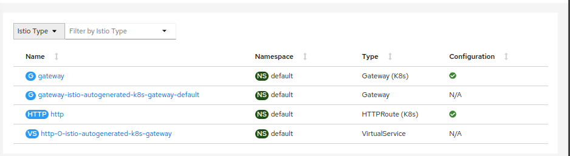
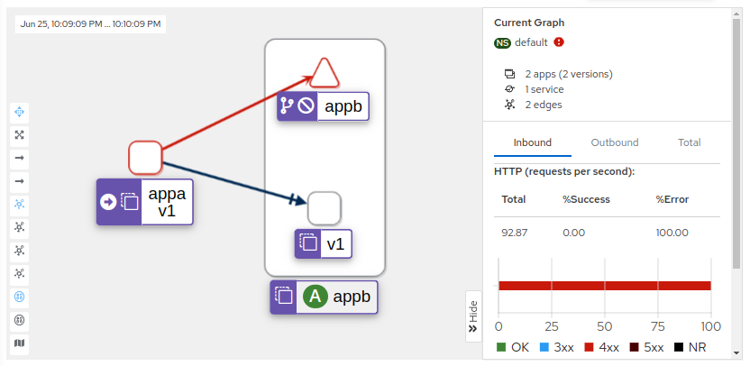

+++
title = "Istio Ambient Service Mesh Demo"
description = "Gateway API demo for Istio Service Mesh on Ambient mode"
date = "2023-06-25"
+++

## Introduction

In this post I will discourse about the new Istio Service Mesh architecture, without sidecar, the problem is solved 
with a very interesting approach a deep diving in these pieces can help out understand the
underlying connections and design of each component and inner workings.

All the code is stored [here](https://github.com/knabben/tutorial-istio-sec/tree/main/3-istio-gw) as magefile target, PR are welcomed.

The following architecture defines this example, having 2 services, `appA` and `appB`,
where `appB` will be accessed from both the Gateway API and from `appA`. A Waypoint is added 
with `appB` service account, and `ztunnel` is reponsible to handle all the Layer 4 traffic.

Istio-CNI component (daemonset) running on each Kubernetes worker node is responsible for 
redirecting application traffic to the zero-trust tunnel (ztunnel).


graph LR;
  LoadBalancer-->gateway
  gateway([gateway api])-->waypoint

  subgraph node 1
  appa([App A])-->istio-cni-->ztunnel1[ztunnel]
  end

  subgraph node 2
  ztunnel2[ztunnel]-->istio-cni2[istio-cni]-->svcb([Service B])
  svcb-->appb([App B])
  end

  waypoint[Waypoint Proxy - SA B]-->ztunnel2
  ztunnel1-->waypoint

  ztunnel1.->istiod
  ztunnel2.->istiod
  waypoint.->istiod

  istiod

  classDef ctrl fill:#1568ca,color:white,stroke-width:1px,stroke:#dbffff
  classDef normal fill:#007cff,color:white,stroke-width:1px,stroke:#fff
  classDef normal1 fill:#f0f0f0,color:black,stroke-width:1px,stroke:#f0f0f5
  classDef cluster fill:#fff,stroke:#bbb,stroke-width:2px,color:#326ce5;
  classDef cluster fill:#fff,stroke:#bbb,stroke-width:2px,color:#326ce5;

  class appa,appb,appc,svcb ctrl;
  class istio-cni,istio-cni2 cluster; 
  class waypoint,gateway normal;
  class LoadBalancer,ztunnel1,ztunnel2,istiod normal1;



### Installing 

The first step is to install Kind and Istio on it, targets install the available
addons as well (prometheus, grafana, jaeger, kiali). It's required to increase fs.inotify parameters in the 
kernel on Kind, otherwise the waypoint wont come up. The steps are documented as follows:

```shell
$ INSTALL_KIND=y mage sm:install
```

The following steps are codified automatically in the `sm:install` target, and work for 
documentation propose.

```shell

$ kind create cluster --name ambient --config tutorial-istio-sec/3-istio-gw/specs/kind.yaml

$ docker exec ambient-worker2 sysctl -w fs.inotify.max_user_instances=1024
$ docker exec ambient-worker2 sysctl -w fs.inotify.max_user_watches=1048576
$ docker exec ambient-control-plane sysctl -w fs.inotify.max_user_instances=1024
$ docker exec ambient-control-plane sysctl -w fs.inotify.max_user_watches=1048576
$ docker exec ambient-worker sysctl -w fs.inotify.max_user_instances=1024
$ docker exec ambient-worker sysctl -w fs.inotify.max_user_watches=1048576

```

The target install MetalLB for Gateway API access.

```shell
$ kubectl apply -f https://raw.githubusercontent.com/metallb/metallb/v0.13.10/config/manifests/metallb-native.yaml
$ kubectl apply -f tutorial-istio-sec/3-istio-gw/specs/metallb_cr.yaml
ipaddresspool.metallb.io/docker created
l2advertisement.metallb.io/empty created
```

Install Gateway API CRDs:

```shell
$ kubectl kustomize github.com/kubernetes-sigs/gateway-api/config/crd?ref=v0.6.2 -o /tmp/kustomized
$ kubectl apply -f /tmp/kustomized
customresourcedefinition.apiextensions.k8s.io/gatewayclasses.gateway.networking.k8s.io created
customresourcedefinition.apiextensions.k8s.io/gateways.gateway.networking.k8s.io created
customresourcedefinition.apiextensions.k8s.io/httproutes.gateway.networking.k8s.io created
```

Finally setup Istio ambient mode with debug flag enabled

```shell
$ istioctl install -y --set values.global.proxy.logLevel=debug -f tutorial-istio-sec/3-istio-gw/specs/istio.yaml
$ kubectl label namespace default istio.io/dataplane-mode=ambient
namespace/default labeled
```
As a last step install the otel addons

```shell
$ kubectl apply -f tutorial-istio-sec/3-istio-gw/specs/otel
```

### The application

The application with `appA` and `appB` are common `httpbin` Dockerfile.


```shell
$ kubectl apply -n default -f tutorial-istio-sec/3-istio-gw/specs/apps
serviceaccount/appa created
service/appa created
deployment.apps/appa created
serviceaccount/appb created
service/appb created
deployment.apps/appb created
```

Create a new global Gateway API and HTTP Route:

```yaml
apiVersion: gateway.networking.k8s.io/v1beta1
kind: Gateway
metadata:
  name: gateway
  namespace: default
spec:
  gatewayClassName: istio
  listeners:
  - name: default
    hostname: "*.opssec.in"
    port: 80
    protocol: HTTP
    allowedRoutes:
      namespaces:
        from: All
---
apiVersion: gateway.networking.k8s.io/v1beta1
kind: HTTPRoute
metadata:
  name: http
  namespace: default
spec:
  parentRefs:
  - name: gateway
  hostnames: ["appb.opssec.in"]
  rules:
  - matches:
    - path:
        type: PathPrefix
        value: /
    backendRefs:
    - name: appb
      port: 8000
```

Apply the waypoint configuration only for the `appB` service account.

```shell
$ istioctl x -n default waypoint apply --service-account appb
```

Test the proxy-config listener configuration for and route.

```shell
$ istioctl proxy-config listener deploy/gateway-istio
ADDRESS PORT  MATCH DESTINATION
        0     ALL   Cluster: connect_originate
0.0.0.0 80    ALL   Route: http.80
0.0.0.0 15021 ALL   Inline Route: /healthz/ready*
0.0.0.0 15090 ALL   Inline Route: /stats/prometheus*

$ istioctl proxy-config route deploy/gateway-istio
NAME        VHOST NAME                    DOMAINS                    MATCH                  VIRTUAL SERVICE
http.80     appb.apifloripa.com.br:80     appb.opssec.in             /*                     http-0-istio-autogenerated-k8s-gateway.default
            backend                       *                          /stats/prometheus*
            backend                       *                          /healthz/ready*
```

Looking on Kiali IstioConfig it will be possible to see a few objects, converted as VirtualService and Istio Gateway autogenerated.
The other option is to remove the Gateway from ambient and point to services inside of it.



### VirtualService and traffic control

Create a new VirtualService adding a delay of 2s for .5 percent in the traffic.

```
apiVersion: networking.istio.io/v1beta1
kind: VirtualService
metadata:
  name: appb
spec:
  hosts:
  - appb
  http:
  - fault:
      delay:
        percentage:
          value: 50.0
        fixedDelay: 2s
    match:
    - uri:
        prefix: "/headers"
    route:
    - destination:
        host: appb
  - route:
    - destination:
        host: appb
```

Start requesting appb from `appA` and observe the latency introduced on half of
the requests.

```shell
$ while true; do curl http://appb:8000/headers -s -o /dev/null -w "%{http_code}\n"; date; done

200 Mon Jun 26 01:01:38 UTC 2023
200 Mon Jun 26 01:01:40 UTC 2023
200 Mon Jun 26 01:01:42 UTC 2023
200 Mon Jun 26 01:01:42 UTC 2023
200 Mon Jun 26 01:01:44 UTC 2023
200 Mon Jun 26 01:01:44 UTC 2023
...
200 Mon Jun 26 01:02:01 UTC 2023
200 Mon Jun 26 01:02:03 UTC 2023
200 Mon Jun 26 01:02:03 UTC 2023
200 Mon Jun 26 01:02:05 UTC 2023
200 Mon Jun 26 01:02:05 UTC 2023
200 Mon Jun 26 01:02:05 UTC 2023
```

### Authorization L7

As a last exercise create a AuthorizationPolicy for the `appB` allowing only
`appA` and the `gateway-istio` service account, perceive this is being binded
in the waypoint proxy.

```yaml
apiVersion: security.istio.io/v1beta1
kind: AuthorizationPolicy
metadata:
  name: authz-appb
  namespace: default
spec:
  selector:
    matchLabels:
      istio.io/gateway-name: appb
  action: ALLOW
  rules:
    - from:
        - source:
            principals:
              - cluster.local/ns/default/sa/appa
              - cluster.local/ns/default/sa/gateway-istio
      to:
      - operation:
          methods:
          - GET
```

To test the authorization change remove SPIFFE ID `cluster.local/ns/default/sa/appa`

Observe the graph for east-west traffic on Kiali, filtering by TCP is possible to
see throughput of L4 requests and L7 metrics with HTTP status 403 in red the connection.



### Conclusion

{}
Ambient mesh is still in ALPHA, so breaking changes are expected. Gateway API API is v1beta1.
Kiali dashboard support is still WIP.
{}

The fact ztunnel with a decoupled proxy for Layer 7 is introduced on Ambient provide a service mesh
setup with a much cleaner interface and components, giving less resource consumption and stable
rules, excited to follow in the next steps and integrations provided by this procedure.

One of the great work being done is the replacement of iptables istio-cni rules to [eBFP upstream](https://www.solo.io/blog/ebpf-for-service-mesh/)
what can definitely close this story with a golden key, and bump up this architecture to 
another level, maybe with 1.19?

