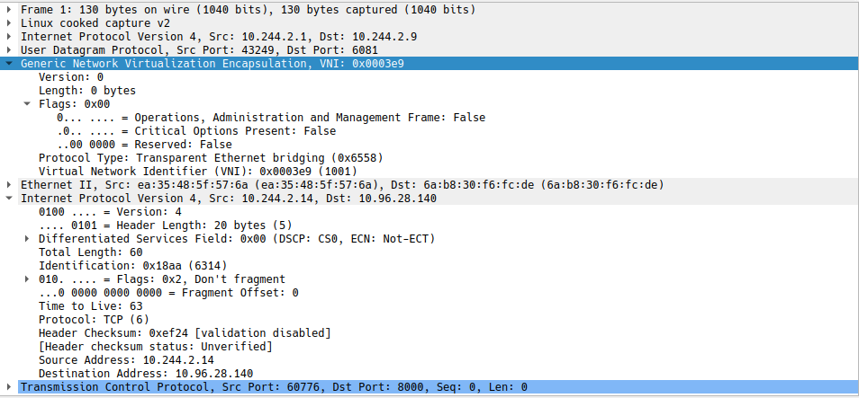

+++
title = "Istio CNI on Ambient Mesh"
description = "Debugging Istio CNI on Ambient mesh"
date = "2023-06-28"
+++

## Introduction

From [Istio Ambient Explained](https://www.solo.io/resources/ebook/istio-ambient-mesh-explained/) - Istio CNI handles traffic redirection for sidecars. 
Istio ambient extends this CNI plug-in for scenarios where there is no sidecar and the mTLS 
running on the node needs to handle the traffic (both incoming and outgoing). In Istio
ambient, the Istio CNI plug-in installs redirection rules (based on iptables/ebpf are a WIP still)
that captures traffic for workloads considered part of the ambient mesh, and redirects to the
ztunnel running on the node.
 
For the version on Ambient the `istio-cni` installed on `/opt/cni/bin/` is installed on each node
and will setup the networking rules, instead of being injected as `initContainers` as in the old approach.
This is required for communication encryption and interception in the mesh.

### Architecture 

The following diagrams presents the sequence of events inside the `install-cni` container that comes up
when `istioctl` is used. As pods are added or removed the plug-in will dynamically update the 
redirection rules.


graph LR;

    NewServer-->setupHandlers
    setupHandlers-->Reconcile
    Reconcile-->ReconcileZtunnel
    
    NewServer-->UpdateConfig
    NewServer-->server
    server-->Start[Start]

    ReconcileZtunnel-->cleanupNode
    ReconcileZtunnel-->CreateRulesOnNode
    ReconcileZtunnel-->CreateRulesWithinNodeProxyNS


  classDef ctrl fill:#1568ca,color:white,stroke-width:1px,stroke:#dbffff
  classDef normal fill:#007cff,color:white,stroke-width:1px,stroke:#
  classDef cluster fill:#fff,stroke:#bbb,stroke-width:2px,color:#326ce5;
  classDef cluster fill:#fff,stroke:#bbb,stroke-width:2px,color:#326ce5;

  class NewServer,ReconcileZtunnel ctrl;
  class UpdateConfig,server,setupHandlers,cleanupNode,CreateRulesOnNode,CreateRulesWithinNodeProxyNS cluster; 
  class Reconcile,Start normal;


`NewServer` when ambient is enabled a new CNI ambient server is started. `setupHandlers`
 will start the informers for pod and namespace where ambient is enabled, on this
  case only `default` is:

```shell

2023-06-28T00:00:12.005195Z	info	ambient	HostIP=10.244.1.1
2023-06-28T00:00:12.005250Z	debug	ambient	Generating new ambient config file
2023-06-28T00:00:12.005274Z	info	ambient	Writing ambient config: {"ztunnelReady":false,"redirectMode":"iptables"}
2023-06-28T00:00:12.005433Z	debug	ambient	Done
2023-06-28T00:00:12.005439Z	debug	ambient	CNI ambient server starting

2023-06-28T00:00:12.006316Z	info	ambient	Namespace default is enabled in ambient mesh
2023-06-28T00:00:12.006337Z	info	ambient	Namespace istio-system is disabled from ambient mesh
2023-06-28T00:00:12.006341Z	info	ambient	Namespace kube-node-lease is disabled from ambient mesh
2023-06-28T00:00:12.006344Z	info	ambient	Namespace kube-public is disabled from ambient mesh
2023-06-28T00:00:12.006346Z	info	ambient	Namespace kube-system is disabled from ambient mesh
2023-06-28T00:00:12.006348Z	info	ambient	Namespace local-path-storage is disabled from ambient mesh
2023-06-28T00:00:12.006351Z	info	ambient	Namespace metallb-system is disabled from ambient mesh

2023-06-28T00:00:12.106387Z	info	controllers	starting	controller=ambient
2023-06-28T00:00:12.106510Z	debug	controllers	handling update: istio-system/grafana-7d4f5589fb-6j9p6	controller=ambient
2023-06-28T00:00:12.106414Z	info	repair	Start CNI race condition repair.
```

Event handlers for pod in the node will be enqueued on a new Ambient queue, and parsed by the `Reconcile`
method of the server.

```golang
	// We only need to handle pods on our node
	s.pods = kclient.NewFiltered[*corev1.Pod](s.kubeClient, kclient.Filter{FieldSelector: "spec.nodeName=" + NodeName})
	s.pods.AddEventHandler(controllers.FromEventHandler(func(o controllers.Event) {
		log.Debug(o.Event.String())
		s.queue.Add(o)
	}))
```

### Ztunnel

* `install-cni` daemoset in `ambient` mode.
  * copies `istio-cni` to `/opt/cni/bin`
    * `istio-cni` when called via CmdAdd add himself to the `ipset` list 
    * add routes to communicate with the ztunnel pod
  * creates kubeconfig for the service account the pod runs under (ZZZ-istio-cni-kubeconfig)
  * injects the CNI plugin config to the CNI config file
  * creates iptables rules to forward traffic from the `ipset` to the ztunnel


Each pod in the node will generate an event and the Ztunnels one have a special treatment, the first
event will be an `type=add`, to collect debugging logs edit the daemonset of istio-cni-node and add
`--log_output_level=all:debug`.


```shell
2023-06-28T00:00:12.106559Z	debug	controllers	handling update: istio-system/istio-cni-node-972h9	controller=ambient
2023-06-28T18:31:26.275442Z	debug	controllers	handling update: istio-system/grafana-7d4f5589fb-gfhcb	controller=ambient
2023-06-28T18:31:26.275483Z	debug	controllers	handling update: istio-system/istio-cni-node-6nhs5	controller=ambient
2023-06-28T18:31:26.275501Z	debug	controllers	handling update: istio-system/jaeger-58c79c85cd-9xwv6	controller=ambient
2023-06-28T18:31:26.275519Z	debug	controllers	handling update: istio-system/kiali-749d76d7bb-bk4l5	controller=ambient

2023-06-28T18:31:26.275555Z	debug	controllers	handling update: istio-system/ztunnel-bxc9w	controller=ambient  <<--
2023-06-28T18:31:26.275572Z	debug	ambient	ztunnel pod set as active
2023-06-28T18:31:26.275575Z	debug	ambient	Generating new ambient config file
2023-06-28T18:31:26.275584Z	info	ambient	Writing ambient config: {"ztunnelReady":true,"redirectMode":"iptables"}
2023-06-28T18:31:26.275717Z	debug	ambient	Done
2023-06-28T18:31:26.275723Z	info	ambient	active ztunnel updated to ztunnel-bxc9w
2023-06-28T18:31:26.275727Z	info	ambient	Node-level network rule cleanup started
2023-06-28T18:31:26.275729Z	info	ambient	Detecting iptables command
2023-06-28T18:31:26.289536Z	info	ambient	Using iptables command: iptables-nft
2023-06-28T18:31:26.289583Z	debug	ambient	Running command: iptables-nft -t nat -F ztunnel-PREROUTING
2023-06-28T18:31:26.291056Z	debug	ambient	Command error output: 
```

If the pod is ztunnel (has a label app=ztunnel), there will a path in the ReconcileZtunnel, different from the other pods.


```golang
	if ztunnelPod(pod) {
		return s.ReconcileZtunnel()
	}
```

If you check the rules created in the node with `iptables-save`, you will see something like:

```shell
:ztunnel-FORWARD - [0:0]
:ztunnel-INPUT - [0:0]
:ztunnel-OUTPUT - [0:0]
:ztunnel-POSTROUTING - [0:0]
:ztunnel-PREROUTING - [0:0]
-A PREROUTING -j ztunnel-PREROUTING
-A INPUT -j ztunnel-INPUT
-A FORWARD -j ztunnel-FORWARD
-A OUTPUT -j ztunnel-OUTPUT
-A POSTROUTING -j ztunnel-POSTROUTING
-A ztunnel-FORWARD -m mark --mark 0x220/0x220 -j CONNMARK --save-mark --nfmask 0x220 --ctmask 0x220
-A ztunnel-FORWARD -m mark --mark 0x210/0x210 -j CONNMARK --save-mark --nfmask 0x210 --ctmask 0x210
-A ztunnel-INPUT -m mark --mark 0x220/0x220 -j CONNMARK --save-mark --nfmask 0x220 --ctmask 0x220
-A ztunnel-INPUT -m mark --mark 0x210/0x210 -j CONNMARK --save-mark --nfmask 0x210 --ctmask 0x210
-A ztunnel-OUTPUT -s 10.244.2.1/32 -j MARK --set-xmark 0x220/0xffffffff
-A ztunnel-PREROUTING -i istioin -j MARK --set-xmark 0x200/0x200
-A ztunnel-PREROUTING -i istioin -j RETURN
-A ztunnel-PREROUTING -i istioout -j MARK --set-xmark 0x200/0x200
-A ztunnel-PREROUTING -i istioout -j RETURN
-A ztunnel-PREROUTING -p udp -m udp --dport 6081 -j RETURN
-A ztunnel-PREROUTING -m connmark --mark 0x220/0x220 -j MARK --set-xmark 0x200/0x200
-A ztunnel-PREROUTING -m mark --mark 0x200/0x200 -j RETURN
-A ztunnel-PREROUTING ! -i veth9f651c51 -m connmark --mark 0x210/0x210 -j MARK --set-xmark 0x40/0x40
-A ztunnel-PREROUTING -m mark --mark 0x40/0x40 -j RETURN
-A ztunnel-PREROUTING ! -s 10.244.2.3/32 -i veth9f651c51 -j MARK --set-xmark 0x210/0x210
-A ztunnel-PREROUTING -m mark --mark 0x200/0x200 -j RETURN
-A ztunnel-PREROUTING -i veth9f651c51 -j MARK --set-xmark 0x220/0x220
-A ztunnel-PREROUTING -p udp -j MARK --set-xmark 0x220/0x220
-A ztunnel-PREROUTING -m mark --mark 0x200/0x200 -j RETURN
-A ztunnel-PREROUTING -p tcp -m set --match-set ztunnel-pods-ips src -j MARK --set-xmark 0x100/0x100
:ztunnel-POSTROUTING - [0:0]
:ztunnel-PREROUTING - [0:0]
-A PREROUTING -j ztunnel-PREROUTING
-A POSTROUTING -j ztunnel-POSTROUTING
-A ztunnel-POSTROUTING -m mark --mark 0x100/0x100 -j ACCEPT
-A ztunnel-PREROUTING -m mark --mark 0x100/0x100 -j ACCEPT
```

The first `cleanupNode` will fail because there will be no rules created, the commands can be seen bellow.
`CreateRulesOnNode` initializes the routing, firewall and ipset rules on the node, this ipset is used to
save a list of IPs of pods in the node and in the ambient mesh.

```shell
Try `ipset help' for more information.
root@ambient-worker2:/# ipset list
Name: ztunnel-pods-ips
Type: hash:ip
Revision: 0
Header: family inet hashsize 1024 maxelem 65536
Size in memory: 280
References: 1
Number of entries: 1
Members:
10.244.1.7
```

As stated in the list the match-set mark the packets as 0x100.
It creates a Geneve tunnel from the node to the the ztunnel pod, and the requiring table and routes.
The table 101 for example foward all the traffic to 192.168.127.2 (the geneve endpoint of the ztunnel)
and rules 101 do for all the packets marked as 0x100 (all the pods in the mesh).

This flow is well explained on [this](https://www.youtube.com/watch?v=WOq4pxEHkwg) video series.


```shell
2023-06-28T20:44:57.644303Z     debug   ambient CreateRulesOnNode: ztunnelVeth=veth87a7244e, ztunnelIP=10.244.1.5
...
2023-06-28T20:44:57.679304Z     debug   ambient Building inbound tunnel: &{LinkAttrs:{Index:0 MTU:0 TxQLen:0 Name:istioin HardwareAddr: Flags:0 RawFlags:0 ParentIndex:0 MasterIndex:0 Namespace:<nil> Alias: Statistics:<nil> Promisc:0 Allmulti:0 Multi:0 Xdp:<nil> EncapType: Protinfo:<nil> OperState:unknown PhysSwitchID:0 NetNsID:0 NumTxQueues:0 NumRxQueues:0 GSOMaxSize:0 GSOMaxSegs:0 Vfs:[] Group:0 Slave:<nil>} ID:1000 Remote:10.244.1.5 Ttl:0 Tos:0 Dport:0 UdpCsum:0 UdpZeroCsum6Tx:0 UdpZeroCsum6Rx:0 Link:0 FlowBased:false}
2023-06-28T20:44:57.679554Z     debug   ambient Building outbound tunnel: &{LinkAttrs:{Index:0 MTU:0 TxQLen:0 Name:istioout HardwareAddr: Flags:0 RawFlags:0 ParentIndex:0 MasterIndex:0 Namespace:<nil> Alias: Statistics:<nil> Promisc:0 Allmulti:0 Multi:0 Xdp:<nil> EncapType: Protinfo:<nil> OperState:unknown PhysSwitchID:0 NetNsID:0 NumTxQueues:0 NumRxQueues:0 GSOMaxSize:0 GSOMaxSegs:0 Vfs:[] Group:0 Slave:<nil>} ID:1001 Remote:10.244.1.5 Ttl:0 Tos:0 Dport:0 UdpCsum:0 UdpZeroCsum6Tx:0 UdpZeroCsum6Rx:0 Link:0 FlowBased:false}
2023-06-28T20:44:57.679899Z     debug   ambient Running command: ip route add table 101 10.244.1.5 dev veth87a7244e scope link
2023-06-28T20:44:57.680975Z     debug   ambient Running command: ip route add table 101 0.0.0.0/0 via 192.168.127.2 dev istioout
2023-06-28T20:44:57.681943Z     debug   ambient Running command: ip route add table 102 10.244.1.5 dev veth87a7244e scope link
2023-06-28T20:44:57.682897Z     debug   ambient Running command: ip route add table 102 0.0.0.0/0 via 10.244.1.5 dev veth87a7244e onlink
2023-06-28T20:44:57.683857Z     debug   ambient Running command: ip route add table 100 10.244.1.5 dev veth87a7244e scope link
2023-06-28T20:44:57.684861Z     debug   ambient Running command: ip rule add priority 100 fwmark 0x200/0x200 goto 32766
2023-06-28T20:44:57.685766Z     debug   ambient Running command: ip rule add priority 101 fwmark 0x100/0x100 lookup 101
2023-06-28T20:44:57.686671Z     debug   ambient Running command: ip rule add priority 102 fwmark 0x040/0x040 lookup 102
2023-06-28T20:44:57.687604Z     debug   ambient Running command: ip rule add priority 103 table 100

```

Check the Node ip address with `ip addr`:

```shell
# ip addr
28: istioin: <BROADCAST,MULTICAST,UP,LOWER_UP> mtu 1450 qdisc noqueue state UNKNOWN group default 
    link/ether 4a:f8:e3:99:10:76 brd ff:ff:ff:ff:ff:ff
    inet 192.168.126.1/30 brd 192.168.126.3 scope global istioin
       valid_lft forever preferred_lft forever
29: istioout: <BROADCAST,MULTICAST,UP,LOWER_UP> mtu 1450 qdisc noqueue state UNKNOWN group default 
    link/ether 46:53:9d:d8:ec:be brd ff:ff:ff:ff:ff:ff
    inet 192.168.127.1/30 brd 192.168.127.3 scope global istioout

# ip route
192.168.126.0/30 dev istioin proto kernel scope link src 192.168.126.1 
192.168.127.0/30 dev istioout proto kernel scope link src 192.168.127.1
```

In the ztunnel pod check the `ip addr` command:

```shell
2: eth0@if27: <BROADCAST,MULTICAST,UP,LOWER_UP> mtu 1500 qdisc noqueue state UP group default 
    inet 10.244.2.9/24 brd 10.244.2.255 scope global eth0
7: pistioin: <BROADCAST,MULTICAST,UP,LOWER_UP> mtu 1450 qdisc noqueue state UNKNOWN group default 
    inet 192.168.126.2/30 brd 192.168.126.3 scope global pistioin
8: pistioout: <BROADCAST,MULTICAST,UP,LOWER_UP> mtu 1450 qdisc noqueue state UNKNOWN group default 
    inet 192.168.127.2/30 brd 192.168.127.3 scope global pistioout
```

The last step is the `CreateRulesWithinNodeProxyNS` new rules are created in the network namespace of the 
ztunnel Pod, this will close the Geneve connection back.

```shell
# crictl ps | grep ztu
a23f4efeea569       ded602048352a       19 minutes ago      Running             istio-proxy         0                   20d7834faddc0       ztunnel-v5kj8
#  nsenter -t $(crictl inspect a23f4efeea569 | jq .info.pid) -n iptables-save
:PREROUTING ACCEPT [0:0]
:INPUT ACCEPT [0:0]
:FORWARD ACCEPT [0:0]
:OUTPUT ACCEPT [0:0]
:POSTROUTING ACCEPT [0:0]
-A PREROUTING -i pistioin -p tcp -m tcp --dport 15008 -j TPROXY --on-port 15008 --on-ip 127.0.0.1 --tproxy-mark 0x400/0xfff
-A PREROUTING -i pistioout -p tcp -j TPROXY --on-port 15001 --on-ip 127.0.0.1 --tproxy-mark 0x400/0xfff
-A PREROUTING -i pistioin -p tcp -j TPROXY --on-port 15006 --on-ip 127.0.0.1 --tproxy-mark 0x400/0xfff
-A PREROUTING ! -d 10.244.1.5/32 -i eth0 -p tcp -j MARK --set-xmark 0x4d3/0xfff
```

Following the logs:

```shell
2023-06-28T20:44:57.688640Z     debug   ambient CreateRulesWithinNodeProxyNS: proxyNsVethIdx=2, ztunnelIP=10.244.1.5, hostIP=10.244.1.1, from within netns=cni-6cbb4d97-20b6-1624-f7e7-22bb4d07e06f
...
2023-06-28T20:44:57.788319Z     debug   ambient Building inbound tunnel: &{LinkAttrs:{Index:0 MTU:0 TxQLen:0 Name:pistioin HardwareAddr: Flags:0 RawFlags:0 ParentIndex:0 MasterIndex:0 Namespace:<nil> Alias: Statistics:<nil> Promisc:0 Allmulti:0 Multi:0 Xdp:<nil> EncapType: Protinfo:<nil> OperState:unknown PhysSwitchID:0 NetNsID:0 NumTxQueues:0 NumRxQueues:0 GSOMaxSize:0 GSOMaxSegs:0 Vfs:[] Group:0 Slave:<nil>} ID:1000 Remote:10.244.1.1 Ttl:0 Tos:0 Dport:0 UdpCsum:0 UdpZeroCsum6Tx:0 UdpZeroCsum6Rx:0 Link:0 FlowBased:false}
2023-06-28T20:44:57.788580Z     debug   ambient Building outbound tunnel: &{LinkAttrs:{Index:0 MTU:0 TxQLen:0 Name:pistioout HardwareAddr: Flags:0 RawFlags:0 ParentIndex:0 MasterIndex:0 Namespace:<nil> Alias: Statistics:<nil> Promisc:0 Allmulti:0 Multi:0 Xdp:<nil> EncapType: Protinfo:<nil> OperState:unknown PhysSwitchID:0 NetNsID:0 NumTxQueues:0 NumRxQueues:0 GSOMaxSize:0 GSOMaxSegs:0 Vfs:[] Group:0 Slave:<nil>} ID:1001 Remote:10.244.1.1 Ttl:0 Tos:0 Dport:0 UdpCsum:0 UdpZeroCsum6Tx:0 UdpZeroCsum6Rx:0 Link:0 FlowBased:false}
2023-06-28T20:44:57.788753Z     debug   ambient Bringing up inbound tunnel: &{LinkAttrs:{Index:7 MTU:0 TxQLen:0 Name:pistioin HardwareAddr: Flags:0 RawFlags:0 ParentIndex:0 MasterIndex:0 Namespace:<nil> Alias: Statistics:<nil> Promisc:0 Allmulti:0 Multi:0 Xdp:<nil> EncapType: Protinfo:<nil> OperState:unknown PhysSwitchID:0 NetNsID:0 NumTxQueues:0 NumRxQueues:0 GSOMaxSize:0 GSOMaxSegs:0 Vfs:[] Group:0 Slave:<nil>} ID:1000 Remote:10.244.1.1 Ttl:0 Tos:0 Dport:0 UdpCsum:0 UdpZeroCsum6Tx:0 UdpZeroCsum6Rx:0 Link:0 FlowBased:false}
2023-06-28T20:44:57.788853Z     debug   ambient Bringing up outbound tunnel: &{LinkAttrs:{Index:8 MTU:0 TxQLen:0 Name:pistioout HardwareAddr: Flags:0 RawFlags:0 ParentIndex:0 MasterIndex:0 Namespace:<nil> Alias: Statistics:<nil> Promisc:0 Allmulti:0 Multi:0 Xdp:<nil> EncapType: Protinfo:<nil> OperState:unknown PhysSwitchID:0 NetNsID:0 NumTxQueues:0 NumRxQueues:0 GSOMaxSize:0 GSOMaxSegs:0 Vfs:[] Group:0 Slave:<nil>} ID:1001 Remote:10.244.1.1 Ttl:0 Tos:0 Dport:0 UdpCsum:0 UdpZeroCsum6Tx:0 UdpZeroCsum6Rx:0 Link:0 FlowBased:false}
2023-06-28T20:44:57.789083Z     debug   ambient Adding netlink route : {Ifindex: 1 Dst: 0.0.0.0/0 Src: <nil> Gw: <nil> Flags: [] Table: 100 Realm: 0}
2023-06-28T20:44:57.789109Z     debug   ambient Adding netlink route : {Ifindex: 8 Dst: 0.0.0.0/0 Src: <nil> Gw: 192.168.127.1 Flags: [] Table: 101 Realm: 0}
2023-06-28T20:44:57.789131Z     debug   ambient Adding netlink route : {Ifindex: 7 Dst: 0.0.0.0/0 Src: <nil> Gw: 192.168.126.1 Flags: [] Table: 102 Realm: 0}
2023-06-28T20:44:57.789149Z     debug   ambient Finding link and parsing host IP
2023-06-28T20:44:57.789186Z     debug   ambient Adding netlink HOST_IP routes : {Ifindex: 2 Dst: 10.244.1.1/32 Src: <nil> Gw: <nil> Flags: [] Table: 101 Realm: 0}
2023-06-28T20:44:57.789210Z     debug   ambient Adding netlink HOST_IP routes : {Ifindex: 2 Dst: 10.244.1.1/32 Src: <nil> Gw: <nil> Flags: [] Table: 102 Realm: 0}
2023-06-28T20:44:57.789228Z     debug   ambient Preparing to apply iptables rules
2023-06-28T20:44:57.789232Z     debug   ambient Running command: iptables-nft -t mangle -F PREROUTING
2023-06-28T20:44:57.790143Z     debug   ambient Running command: iptables-nft -t nat -F OUTPUT
2023-06-28T20:44:57.790956Z     debug   ambient Adding iptables rules
```

When the ztunnel pod is delete all rules are cleaned up.

```shell
2023-06-28T20:32:06.780693Z	debug	ambient	Running command: iptables-nft -t nat -F ztunnel-PREROUTING
2023-06-28T20:32:06.781729Z	debug	ambient	Running command: iptables-nft -t nat -F ztunnel-POSTROUTING
2023-06-28T20:32:06.852360Z	debug	ambient	Running command: iptables-nft -t mangle -F ztunnel-PREROUTING
2023-06-28T20:32:06.932403Z	debug	ambient	Running command: iptables-nft -t mangle -F ztunnel-POSTROUTING
2023-06-28T20:32:07.012423Z	debug	ambient	Running command: iptables-nft -t mangle -F ztunnel-OUTPUT
2023-06-28T20:32:07.068415Z	debug	ambient	Running command: iptables-nft -t mangle -F ztunnel-INPUT
2023-06-28T20:32:07.128401Z	debug	ambient	Running command: iptables-nft -t mangle -F ztunnel-FORWARD
2023-06-28T20:32:07.272462Z	debug	ambient	Running command: iptables-nft -t nat -X ztunnel-PREROUTING
2023-06-28T20:32:07.409026Z	debug	ambient	Running command: iptables-nft -t nat -X ztunnel-POSTROUTING
```

### Installing istio-cni

Each node will have a `/opt/cni/bin/istio-cni` plugin and on this case `/etc/cni/net.d/10-kindnet.conflist` is saved with
the CNI config, the `ZZZ-istio-cni-kubeconfig` contains access to the cluster.

```shell
2023-06-28T19:20:26.487861Z	info	install	Detect changes to the CNI configuration and binaries, attempt reinstalling...
2023-06-28T19:20:26.605883Z	info	install	Copied istio-cni to /host/opt/cni/bin.
2023-06-28T19:20:26.605909Z	info	install	Directory /host/secondary-bin-dir is not writable, skipping.
2023-06-28T19:20:26.605992Z	info	install	write kubeconfig file /host/etc/cni/net.d/ZZZ-istio-cni-kubeconfig with: 
2023-06-28T19:20:26.606132Z	info	install	Using CNI config template from CNI_NETWORK_CONFIG environment variable.
2023-06-28T19:20:26.606141Z	info	install	CNI config: {
  "cniVersion": "0.3.1",
  "name": "istio-cni",
  "type": "istio-cni",
  "log_level": "debug",
  "log_uds_address": "/var/run/istio-cni/log.sock",
  "ambient_enabled": true,
  "kubernetes": {
      "kubeconfig": "/etc/cni/net.d/ZZZ-istio-cni-kubeconfig",
      "cni_bin_dir": "/opt/cni/bin",
      "exclude_namespaces": [ "kube-system" ]
  }
}

2023-06-28T19:20:26.606349Z	info	install	CNI config file /host/etc/cni/net.d/10-kindnet.conflist exists. Proceeding.
2023-06-28T19:20:26.606682Z	info	install	Created CNI config /host/etc/cni/net.d/10-kindnet.conflist
```

### istio-cni

The CNI plugin installed will be called on `CmdAdd` via containerd when a new pod is created, this will set routing and adding the pod ip to the ipset.

```shell 
2023-06-28T23:06:29.902002Z	debug	cni	istio-cni CmdAdd previous result: &{CNIVersion:1.0.0 Interfaces:[{Name:vethd8146a12 Mac:4a:a4:fa:12:37:59 Sandbox:} {Name:eth0 Mac:42:ba:6a:f7:fb:43 Sandbox:/var/run/netns/cni-97d1463e-b8a8-ed68-0e53-5d739167b6a8}] IPs:[{Interface:0xc0004742b0 Address:{IP:10.244.2.19 Mask:ffffff00} Gateway:10.244.2.1}] Routes:[{Dst:{IP:0.0.0.0 Mask:00000000} GW:<nil>}] DNS:{Nameservers:[] Domain: Search:[] Options:[]}}
2023-06-28T23:06:29.902003Z	debug	cni	ambientConf.ZTunnelReady: true
2023-06-28T23:06:29.902007Z	info	cni	istio-cni cmdAdd podName: appb-7774fb945-qhq6l podIPs: [{IP:10.244.2.19 Mask:ffffff00}]
2023-06-28T23:06:29.902008Z	debug	cni	istio-cni set up kubernetes client with kubeconfig /etc/cni/net.d/ZZZ-istio-cni-kubeconfig
2023-06-28T23:06:29.902010Z	info	cni	Adding pod 'appb-7774fb945-qhq6l/default' (65a2dac9-acc4-41cf-a4a8-994a9294051f) to ipset
2023-06-28T23:06:29.902011Z	info	cni	Adding route for appb-7774fb945-qhq6l/default: [table 100 10.244.2.19/32 via 192.168.126.2 dev istioin src 10.244.2.1]
```

### Pods in other nodes

Geneve works by creating Layer 2 logical networks that are encapsulated in UDP packets. A Segment ID in every frame identifies the Geneve logical networks without the need for VLAN tags. 
As a result, many isolated Layer 2 networks can coexist on a common Layer 3 infrastructure using the same VLAN ID.



On this example `appa` on 10.244.2.14 on ambient-worker is on `appb` 10.244.1.7 and ambient-worker2, in case of pods in different nodes
this tunnel is used, when passing through ztunnel. The 10.96.28.140 is the service IP.

```shell
root@ambient-worker:/# tcpdump -i istioout -vvv 
tcpdump: listening on istioout, link-type EN10MB (Ethernet), snapshot length 262144 bytes
23:30:07.961316 IP (tos 0x0, ttl 63, id 2453, offset 0, flags [DF], proto TCP (6), length 60)
    10.244.2.14.58068 > 10.96.28.140.8000: Flags [S], cksum 0x341c (incorrect -> 0xba09), seq 177519862, win 64240, options [mss 1460,sackOK,TS val 2001477164 ecr 0,nop,wscale 7], length 0

root@ambient-worker2:/# tcpdump -i istioin -vvvne 
tcpdump: listening on istioin, link-type EN10MB (Ethernet), snapshot length 262144 bytes
23:35:52.112834 a6:55:ae:89:6c:95 > ce:5e:cf:f6:d3:cd, ethertype IPv4 (0x0800), length 74: (tos 0x0, ttl 62, id 17266, offset 0, flags [DF], proto TCP (6), length 60)
    10.244.2.14.59385 > 10.244.1.7.15008: Flags [S], cksum 0x192b (incorrect -> 0x7ab6), seq 1258817029, win 64240, options [mss 1460,sackOK,TS val 190200415 ecr 0,nop,wscale 7], length 0
```

Checking the ztunnel logs will confirm the traffic is passing through the pod and rules are working, at this point the VIP is already translated to the pod endpoint
and the HBONE connection setup on ztunnel.

```shell
#ambient-worker:

2023-06-28T23:43:39.125296Z  INFO outbound{id=d5d9157a8ffceb216bc7133392e9f073}: ztunnel::proxy::outbound: proxy to 10.244.1.7:80 using HBONE via 10.244.1.7:15008 type Direct
2023-06-28T23:43:39.212939Z  INFO outbound{id=d5d9157a8ffceb216bc7133392e9f073}: ztunnel::proxy::outbound: complete dur=87.687768ms

#ambient-worker2:

2023-06-28T23:45:28.230973Z  INFO inbound{id=517d0619b98713c430f7b558bbfdace8 peer_ip=10.244.2.14 peer_id=spiffe://cluster.local/ns/default/sa/appa}: ztunnel::proxy::inbound: got CONNECT request to 10.244.1.7:80
```
