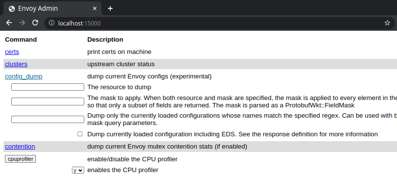

+++
title = "Waypoint Proxy for the app layer"
description = "Handling L7 traffic with Waypoint proxy"
date = "2023-07-02"
+++

## Introduction

[The waypoint proxy](https://www.solo.io/resources/ebook/istio-ambient-mesh-explained/) is a L7 proxy that
 implements application traffic management on this layer. This data plane fully parses the connection
 into requests and can apply policies based on properties like headers and credentials found in the request.
 The functionalities include HTTP/1/2/3, request routing, advanced LB, mirroring, fault injection, retries and gRPC
 treatment.

```shell
istioctl x -n default waypoint apply --service-account appb
appb-76b56f7cb4-jgp6k                 1/1     Running   0          11h   10.244.1.4    ambient-worker2   <none>           <none>
appb-istio-waypoint-6f8dfd8d4-dh4g7   1/1     Running   0          9h    10.244.2.11   ambient-worker    <none>           <none>
 ```

In ambient, all policies are enforced by the destination waypoint. In many ways, the waypoint acts as a gateway into the namespace 
(default scope) or service account. Istio enforces that all traffic coming into the namespace goes through the waypoint, 
which then enforces all policies for that namespace. Because of this, each waypoint only needs to know about configuration for its own namespace.

A change in the shift of source proxy configuration to the destination proxy allowed the scaling and easy debugging besides the
correct ownership and boundaries trust compared to the old model. 

### Waypoint on Ambient

Creating a new waypoint for a specific service is made with the command above, this proxy is used for specific SA `appb`, it's possible
to use one for the entire namespacea as well, the other interesting usage is the listener on port 15008 of type mesh.

```yaml
apiVersion: gateway.networking.k8s.io/v1beta1
kind: Gateway
metadata:
  annotations:
    istio.io/for-service-account: appb
  name: appb
spec:
  gatewayClassName: istio-waypoint
  listeners:
  - name: mesh
    port: 15008
    protocol: HBONE
```

As seen in the ztunnel configuration of the last post the field `{"waypointAddresses": ["10.244.2.11"]}` is present and all incoming requests must go through 
the waypoint. When the request is made from the `outbound` connection the request type `ToServerWaypoint` is used, other options as as follow in the 
connection state:

```rust
enum RequestType {
    /// ToServerWaypoint refers to requests targeting a server waypoint proxy
    ToServerWaypoint,
    /// Direct requests are made directly to a intended backend pod
    Direct,
    /// DirectLocal requests are made directly to an intended backend pod *on the same node*
    DirectLocal,
    /// Passthrough refers to requests with an unknown target
    Passthrough,
}
```

This will force the traffic through the waypoint before being forwarded to the ztunnel and streamer back to the requester.

### Envoy

Besides another name and a different bootstrap envoy is still used for the L7 capability in the mesh.
Hardly recomment the [Hoot series](https://www.youtube.com/watch?v=KsO4pw4tEGA) on Envoy to learn more.

An important concept are the xDS APIs that discovers its various dynamic resources via the filesystem or by querying one 
or more management servers. The most used here are:

* Listener: Listener Discovery Service (LDS)
* RouteConfiguration: Route Discovery Service (RDS)
* Cluster: Cluster Discovery Service (CDS)
* ClusterLoadAssignment: Endpoint Discovery Service (EDS)
* Secret: Secret Discovery Service (SDS)

Some interesting settings were created in the waypoint Pod by istiod, when parsing the Gateway object.

```shell
  istio-proxy:
    Container ID:  containerd://0837c5641b52be5d1361bd90e4c0acfde46ffc556e8e3c7e966c1724c90ee45f
    Image:         docker.io/istio/proxyv2:1.18.0
    Image ID:      docker.io/istio/proxyv2@sha256:757d28c241009d9125607e6e02e71954b86e5f2baabdeda0537361e9be3d2579
    Port:          <none>
    Host Port:     <none>
    Args:
      proxy
      waypoint
      --domain
      $(POD_NAMESPACE).svc.cluster.local
      --serviceCluster
      appb-istio-waypoint.$(POD_NAMESPACE)
      --proxyLogLevel
      debug
      --proxyComponentLogLevel
      misc:error
      --log_output_level

    Environment:
      ISTIO_META_SERVICE_ACCOUNT:     (v1:spec.serviceAccountName)
      ISTIO_META_NODE_NAME:           (v1:spec.nodeName)
      JWT_POLICY:                    third-party-jwt
      PILOT_CERT_PROVIDER:           istiod
      CA_ADDR:                       istiod.istio-system.svc:15012
      POD_NAME:                      appb-istio-waypoint-6f8dfd8d4-dh4g7 (v1:metadata.name)
      POD_NAMESPACE:                 default (v1:metadata.namespace)
      INSTANCE_IP:                    (v1:status.podIP)
      SERVICE_ACCOUNT:                (v1:spec.serviceAccountName)
      HOST_IP:                        (v1:status.hostIP)
      ISTIO_CPU_LIMIT:               2 (limits.cpu)
      PROXY_CONFIG:                  {"proxyMetadata":{"ISTIO_META_ENABLE_HBONE":"true"}}
      
      ISTIO_META_CLUSTER_ID:         Kubernetes
      ISTIO_META_INTERCEPTION_MODE:  REDIRECT
      ISTIO_META_WORKLOAD_NAME:      appb-istio-waypoint
      ISTIO_META_OWNER:              kubernetes://apis/apps/v1/namespaces/default/deployments/appb-istio-waypoint
      ISTIO_META_MESH_ID:            cluster.local
```

#### Istio-agent

The first intresting part of the waypoint bootstrap is the `istio-agent`, responsible to start a SDS server for Secret management and be a proxy for Istio CA. 

```shell
$ /usr/local/bin/pilot-agent proxy waypoint --domain default.svc.cluster.local \
    --serviceCluster appb-istio-waypoint.default \
    --proxyLogLevel debug \
    --proxyComponentLogLevel misc:error \
    --log_output_level default:info
$ /usr/local/bin/envoy -c etc/istio/proxy/envoy-rev.json --drain-time-s 45 \
    --drain-strategy immediate  \
    --local-address-ip-version v4 \
    --file-flush-interval-msec 1000 \
    --disable-hot-restart 
    --allow-unknown-static-fields 
    --log-format %Y-%m-%dT%T.%fZ.%l.envoy %n %g:%#.%v.thread=%t -l debug 
    --component-log-level misc:error 
    --concurrency 2
```

It will start envoy and generate the bootstrap configuration on `/etc/istio/proxy/envoy-rev.json` (This file has 551 lines and 15KB) that contains all the xDS settings.
As static resources we have by default clusters and listeners:

Clusters:

* prometheus_stats - 15000
* agent - 15020
* sds-grpc - /var/run/secrets/workload-spiffe-uds/socket
* xds-grpc - /etc/istio/proxy/XDS <- socket
* zipkin - 9411

Listeners:

* TCP 15090 on /stats/prometheus
* TCP 15021 on /healthz/ready


```json
{
  "node" {
    "id": "waypoint~10.244.2.11~appb-istio-waypoint-6f8dfd8d4-dh4g7.default~default.svc.cluster.local",
    "cluster": "appb-istio-waypoint.default",
  }
  "static_resoures": {
    "clusters": {},
    "listeners": {},
  }
}
```

As stated on this [Istio post](https://istio.io/latest/blog/2023/waypoint-proxy-made-simple/)

At this point Istiod has the waypoint registered and starts to send push, the best resource to read about the specs are the [offical docs](https://www.envoyproxy.io/docs/envoy/latest/intro/intro)
its a has very rich documentation about the proxy. Envoy by default presents an eventual consistency model with xDS, 
ADS allows one or more APIs and their resources to be delivered on a single, bidirectional gRPC stream by the management server.

There's another concept of delta updates where only resources changed are being updated instead o the full state.

```shell
# istiod logs
2023-07-02T00:40:00.284012Z     info    ads     Incremental push, service appb.default.svc.cluster.local at shard Kubernetes/Kubernetes has no endpoints
2023-07-02T00:40:48.907801Z     info    ads     Full push, new service default/appb.default.svc.cluster.local
2023-07-02T02:50:53.542851Z     info    ads     Incremental push, service appb-istio-waypoint.default.svc.cluster.local at shard Kubernetes/Kubernetes has no endpoints
2023-07-02T02:50:53.643663Z     info    delta   WDS: PUSH for node:appb-istio-waypoint-6f8dfd8d4-dh4g7.default resources:1 removed:0 size:181B
2023-07-02T02:50:54.537988Z     info    delta   CDS: PUSH for node:appb-istio-waypoint-6f8dfd8d4-dh4g7.default resources:5 removed:0 size:2.3kB
2023-07-02T02:50:54.538111Z     info    delta   EDS: PUSH for node:appb-istio-waypoint-6f8dfd8d4-dh4g7.default resources:2 removed:0 size:304B empty:1 cached:0/2
2023-07-02T02:50:54.538426Z     info    delta   LDS: PUSH for node:appb-istio-waypoint-6f8dfd8d4-dh4g7.default resources:3 removed:0 size:7.5kB
2023-07-02T02:50:54.538540Z     info    delta   WDS: PUSH for node:appb-istio-waypoint-6f8dfd8d4-dh4g7.default resources:17 removed:0 size:2.6kB
```

When the waypoint is up, it's possible to access the admin dashboard on 15000 localhost, to see things like metrics, configuration
settings, etc.



For comparision lets see whats the config looks like after the waypoint is inside the mesh `http://localhost:15000/config_dump` (with 4017 lines and 12KB),
the interesting part are the new dynamic_resources loaded here:

```shell
{
  "dynamic_resources": {
    "lds_config": {
      "ads": {},
      "initial_fetch_timeout": "0s",
      "resource_api_version": "V3"
    },
    "cds_config": {
      "ads": {},
      "initial_fetch_timeout": "0s",
      "resource_api_version": "V3"
    },
    "ads_config": {
      "api_type": "DELTA_GRPC",
      "grpc_services": [
        {
          "envoy_grpc": {
            "cluster_name": "xds-grpc"
          }
        }
      ],
      "set_node_on_first_message_only": true,
      "transport_api_version": "V3"
    }
}
```

It's now using the socket xds-grpc proxied by the agent to receive push configuration from Istiod.

### Metrics

After doing requests from server `appa` its possible to see the metrics, there's a Gateway API exposed as well in the host `appb.example.com.br`:

```shell
# TYPE istio_requests_total counter
istio_requests_total{reporter="destination"
    source_workload="appa"
    source_canonical_service="appa"
    source_canonical_revision="v1"
    source_workload_namespace="default"
    source_principal="spiffe://cluster.local/ns/default/sa/appa"
    source_app="unknown"
    source_version="unknown"
    source_cluster="Kubernetes"
    destination_workload="appb"
    destination_workload_namespace="default"
    destination_principal="spiffe://cluster.local/ns/default/sa/appb-istio-waypoint"
    destination_app="unknown"
    destination_version="unknown"
    destination_service="appb.default.svc.cluster.local"
    destination_canonical_service="appb"
    destination_canonical_revision="v1"
    destination_service_name="appb"
    destination_service_namespace="default"
    destination_cluster="Kubernetes"
    request_protocol="http"
    response_code="200"
    grpc_response_status=""
    response_flags="-"
    connection_security_policy="mutual_tls"} 10

istio_requests_total{reporter="destination"
    source_workload="gateway-istio"
    source_canonical_service="gateway-istio"
    source_canonical_revision="latest"
    source_workload_namespace="default"
    source_principal="spiffe://cluster.local/ns/default/sa/gateway-istio"
    source_app="unknown"
    source_version="unknown"
    source_cluster="Kubernetes"
    destination_workload="unknown"
    destination_workload_namespace="default"
    destination_principal="spiffe://cluster.local/ns/default/sa/appb-istio-waypoint"
    destination_app="unknown"
    destination_version="unknown"
    destination_service="appb.example.com.br"
    destination_canonical_service="unknown"
    destination_canonical_revision="unknown"
    destination_service_name="appb.example.com.br"
    destination_service_namespace="default"
    destination_cluster="Kubernetes"
    request_protocol="http"
    response_code="200"
    grpc_response_status=""
    response_flags="-"
    connection_security_policy="mutual_tls"} 3
```

#### Checking xDS configuration

To start debugging, right now lets investigate the istioctl commands on our example cluster with the app topology
created, istioctl offers a better tool to visualize your proxy config instead of the config_dump endpoint.

Checking the `clusters` created in this waypoint, we are NOT checking the Gateway API:

```
$ istioctl pc cluster deploy/appb-istio-waypoint

SERVICE FQDN                             PORT     SUBSET     DIRECTION       TYPE             DESTINATION RULE
appb.default.svc.cluster.local           8000     http       inbound-vip     EDS              
connect_originate                        -        -          -               ORIGINAL_DST     
encap                                    -        -          -               STATIC           
kubernetes.default.svc.cluster.local     443      tcp        inbound-vip     EDS              
main_internal                            -        -          -               STATIC           

$ istioctl pc endpoints deploy/appb-istio-waypoint

ENDPOINT                                                STATUS      OUTLIER CHECK     CLUSTER
10.244.1.4:15008                                        HEALTHY     OK                connect_originate
10.244.1.4:15008                                        HEALTHY     OK                connect_originate
127.0.0.1:15020                                         HEALTHY     OK                agent
envoy://connect_originate/                              HEALTHY     OK                encap
envoy://connect_originate/10.244.1.4:80                 HEALTHY     OK                inbound-vip|8000|http|appb.default.svc.cluster.local
envoy://main_internal/                                  HEALTHY     OK                main_internal
unix://./etc/istio/proxy/XDS                            HEALTHY     OK                xds-grpc
unix://./var/run/secrets/workload-spiffe-uds/socket     HEALTHY     OK                sds-grpc

```

There're 2 upstream endpoints in the cluster from xDS API (Enpoint Discovery Service) config_dump:

```json
{
    "name": "inbound-vip|8000|http|appb.default.svc.cluster.local",
    "type": "EDS",
    "edsClusterConfig": {
        "edsConfig": {
            "ads": {},
            "initialFetchTimeout": "0s",
            "resourceApiVersion": "V3"
        },
        "serviceName": "inbound-vip|8000|http|appb.default.svc.cluster.local"
    },
    "commonLbConfig": {},
    "transportSocket": {
        "name": "internal_upstream",
        "typedConfig": {
            "@type": "type.googleapis.com/envoy.extensions.transport_sockets.internal_upstream.v3.InternalUpstreamTransport",
            "passthroughMetadata": [
                {
                    "kind": {
                        "host": {}
                    },
                    "name": "tunnel"
                }
            ],
            "transportSocket": {
                "name": "raw_buffer",
                "typedConfig": {
                    "@type": "type.googleapis.com/envoy.extensions.transport_sockets.raw_buffer.v3.RawBuffer"
                }
            }
        }
    }
}
```

It's possible to perceive the signature for this upstream service "inbound-vip|8000|http|appb.default.svc.cluster.local". Now check the listeners available,
For requests arriving the HBONE port, waypoint forwards the request to `main_internal` this way it enforces the workload policies (i.e. AuthorizationPolicy). 

As a last step check the listeners and routes for each one. `10.95.15.53` is the Service VIP, the direct-http/tcp on `10.244.1.4` points to the actual pod for HTTP/1.1 proto and h2c:

```shell
$ istioctl pc listener deploy/appb-istio-waypoint --waypoint

LISTENER                  CHAIN                                                     MATCH                                            DESTINATION
envoy://main_internal     inbound-vip|8000||appb.default.svc.cluster.local-http     ip=10.96.15.53 -> port=8000                      Cluster: inbound-vip|8000|http|appb.default.svc.cluster.local
envoy://main_internal     inbound-vip|443||kubernetes.default.svc.cluster.local-tcp ip=10.96.0.1 -> port=443                         Cluster: inbound-vip|443|tcp|kubernetes.default.svc.cluster.local
envoy://main_internal     direct-tcp                                                ip=10.244.1.4 -> ANY                             Cluster: encap
envoy://main_internal     direct-http                                               ip=10.244.1.4 -> application-protocol='h2c'      Cluster: encap
envoy://main_internal     direct-http                                               ip=10.244.1.4 -> application-protocol='http/1.1' Cluster: encap

$ istioctl pc route deploy/appb-istio-waypoint

NAME                                                     VHOST NAME            DOMAINS     MATCH                  VIRTUAL SERVICE
inbound-vip|8000|http|appb.default.svc.cluster.local     inbound|http|8000     *           /*                     
default                                                  default               *                                  
encap                                                    inbound|http|0        *           /*                     
```
