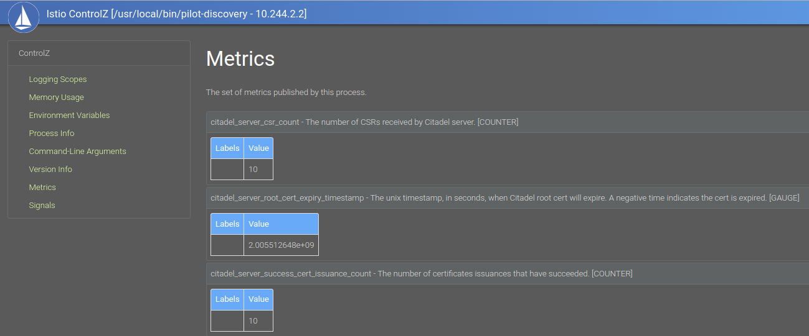

+++
title = "Ztunnel SPIRE implementation"
description = "Workflow and discussions around Istio CA/SPIRE/SDS implementation"
date = "2023-07-22"
+++

## Introduction

The PKI/xDS workload integration and certificate generation can be complex, this is executed since forever from
the Envoy and pilot-agent, Istio CA offers the SVID x509 certificates for workload identification. For this sidecar 
version, the pilot-agent (that bootstrap the sidecar) sends the Kubernetes API token and a CSR, istiod 
validates the token and on success signs the certifcate returning the response, the agent uses SDS to configure the 
envoy, for more details see Appendix C from [Istio In Action](https://www.amazon.com/Istio-Action-Christian-Posta/dp/1617295825).

### Ztunnel connection


The ztunnel config_dump can be achieved by curl on *http://localhost:15000/config_dump*, on this example
the default ca_address is istiod service on `15012` port

```json
{
    "config" {
        "ca_address": "https://istiod.istio-system.svc:15012",
        "ca_root_cert": {
            "File": "./var/run/secrets/istio/root-cert.pem"
        },
        "xds_address": "https://istiod.istio-system.svc:15012",
        "xds_root_cert": {
            "File": "./var/run/secrets/istio/root-cert.pem"
        },
        "xds_on_demand": false,
        "fake_ca": false,
    },
    "certificates": [
        {
          "identity": "spiffe://cluster.local/ns/istio-system/sa/default",
          "state": "Available",
          "ca_cert": [
            {
              "pem": "-----BEGIN CERTIFICATE-----\nMIICezCCAWOgAwIBAgIRAP8JePgRMVctsN5ODWGReMkwDQYJKoZIhvcNAQELBQAw\nGDEWMBQGA1UEChMNY2x1c3Rlci5sb2NhbDAeFw0yMzA3MjMyMjUzMTlaFw0yMzA3\nMjQyMjU1MTlaMAAwWTATBgcqhkjOPQIBBggqhkjOPQMBBwNCAAQflxE7v8JJsph9\n29t/gf7L24o3jxfXj4Zz4Im9F3k00/7pEny7FxQby8f8pJy8oM+rVRLYmRxD64vO\n0MN4isPao4GiMIGfMA4GA1UdDwEB/wQEAwIFoDAdBgNVHSUEFjAUBggrBgEFBQcD\nAQYIKwYBBQUHAwIwDAYDVR0TAQH/BAIwADAfBgNVHSMEGDAWgBQVGuGZItNOyxnG\n7Xc0lT65wHhKMjA/BgNVHREBAf8ENTAzhjFzcGlmZmU6Ly9jbHVzdGVyLmxvY2Fs\nL25zL2lzdGlvLXN5c3RlbS9zYS9kZWZhdWx0MA0GCSqGSIb3DQEBCwUAA4IBAQBQ\n4/qL+tFrnuGVisi86furPxwNRmwInoweJwRBfLl/VQEalpXzCXbLCZuKLYdBrcL4\nSw2qFE1PWYmaDOGqcVN9HNx0OCY6SvHAnqV4NFDjzbdB/CVFhAhW5Sbkg7vVOlBI\nNBx96d4oMjnGVvyeXnnMoOn8HFGf/e0mtRSp8aP+agPetN2EpowKO4F/tCYImxS2\n7iq/CQwe8HkTtAM7v+AUC26NKqtRuqJbCkvmMd/JoTmxAPr7yKjw6lIP9Rf8jDeL\npvvFEY4dSFxaOBm/O7NspryGHZamKjijGnSfLXIJkdhAWh+Cc5KrfUmLNd/i87kG\nT/x9GuidXmCsZBPmXC2Q\n-----END CERTIFICATE-----\n",
              "serial_number": "339002323139937996997990357496333695177",
              "valid_from": "2023-07-23T22:53:19Z",
              "expiration_time": "2023-07-24T22:55:19Z"
            }
          ],
          "cert_chain": [
            {
              "pem": "-----BEGIN CERTIFICATE-----\nMIIC/TCCAeWgAwIBAgIRAPfBaOGONn5h80zqgRMEooEwDQYJKoZIhvcNAQELBQAw\nGDEWMBQGA1UEChMNY2x1c3Rlci5sb2NhbDAeFw0yMzA3MjMyMjUwNDhaFw0zMzA3\nMjAyMjUwNDhaMBgxFjAUBgNVBAoTDWNsdXN0ZXIubG9jYWwwggEiMA0GCSqGSIb3\nDQEBAQUAA4IBDwAwggEKAoIBAQCSBwI43dBsthRlLeMNskGuLX0ziK1MIjJtK59h\nI5Nz23DIJcVy4mfsFOaIrLpHLhGg0SDon9guTAu50ueYwXD2u6F70ugN9pFTm4HS\n3PFFrlFoIkFFz3zMnd98AX0e5nk4all7TOK0q1Na8oh3wDhLyvdKD/MFgvhvbJJq\n5+SO2ppHIoY03JEYTkaRldCNmj3/31XDgQM8VrsL80Q7PxXd08ClUlfxtFmKMGax\nBLQOHkCVMToP6cOrBNfB+WJ/50zzrSqa4IDKQO3Wx0wPoimmk1m5tvC7/0XQ7L9Z\neYTKlv4QplMWmbtHoLqt8wL/r2XzlC3DClWjxP/XoEX+Ze1ZAgMBAAGjQjBAMA4G\nA1UdDwEB/wQEAwICBDAPBgNVHRMBAf8EBTADAQH/MB0GA1UdDgQWBBQVGuGZItNO\nyxnG7Xc0lT65wHhKMjANBgkqhkiG9w0BAQsFAAOCAQEAWq5OGrCRDc5pSYJW8TtR\nfb0ke0uhEmZH8cytbRGRmTCsaMi+BQRCMP1iJqw8rLxT6FzIhaj7ggK1M0AwZ0GF\n3DZM2Kr16spcuGdLte1X/RduiTfLXs/6toGLw1ATfK87igbKsCz7QGgiVJDjDRvj\nrri5XjjIbw3ZTjlIPhTNWjvnzdNHZ/Px4s/AILnxgByoeey6vnvQ3Fb9P3vvb+P9\nvAVe7CgoHxn1fOcPhpT9ofNMr3FIk5rze9lJ2wRWj1x+iQCYKp3Atrfuv/7XmJnG\n5PXFr1PaaO2GxEGlxk9HrlpoJ735qUruaZRrvEV3ZIN/3ICypPNa2pM2eslB7Hky\nwQ==\n-----END CERTIFICATE-----\n",
              "serial_number": "329323555493519538036679630491320885889",
              "valid_from": "2023-07-23T22:50:48Z",
              "expiration_time": "2033-07-20T22:50:48Z"
            }
          ]
        }
    ]
}
```

The first interesting to see is the CA root-cert.pem used by the XDS root cert and CA root cert.
This is mounted from the root CA exitent on `istio-ca-root-cert`

```shell
Certificate:
    Data:
        Version: 3 (0x2)
        Serial Number:
            f7:c1:68:e1:8e:36:7e:61:f3:4c:ea:81:13:04:a2:81
        Signature Algorithm: sha256WithRSAEncryption
        Issuer: O = cluster.local
        Validity
            Not Before: Jul 23 22:50:48 2023 GMT
            Not After : Jul 20 22:50:48 2033 GMT
        Subject: O = cluster.local
        Subject Public Key Info:
            Public Key Algorithm: rsaEncryption
                Public-Key: (2048 bit)
                Modulus:
                ...
                Exponent: 65537 (0x10001)
        X509v3 extensions:
            X509v3 Basic Constraints: critical
                CA:TRUE
            X509v3 Subject Key Identifier:
                15:1A:E1:99:22:D3:4E:CB:19:C6:ED:77:34:95:3E:B9:C0:78:4A:32
```

The second part where the certificates exists, they are the SVID from the workload API, executing the following command from 
a ztunnel can print the actual certificate value:

```shell
kubectl -n istio-system exec -it ztunnel-5f4qm -- curl localhost:15000/config_dump | jq -r .certificates\[0\].ca_cert\[0\].pem | openssl x509 -text
```

As you can note the `SPIFFEID` is `spiffe://cluster.local/ns/istio-system/sa/default` used for the default service account 
this is set on Subject Alternative Name property of the cert.

```shell
Certificate:
    Data:
        Version: 3 (0x2)
        Serial Number:
            ff:09:78:f8:11:31:57:2d:b0:de:4e:0d:61:91:78:c9
        Signature Algorithm: sha256WithRSAEncryption
        Issuer: O = cluster.local
        Validity
            Not Before: Jul 23 22:53:19 2023 GMT
            Not After : Jul 24 22:55:19 2023 GMT
        Subject:
        Subject Public Key Info:
            Public Key Algorithm: id-ecPublicKey
                Public-Key: (256 bit)
                pub:
                    04:1f:97:11:3b:bf:c2:49:b2:98:7d:db:db:7f:81:
                    fe:cb:db:8a:37:8f:17:d7:8f:86:73:e0:89:bd:17:
                    79:34:d3:fe:e9:12:7c:bb:17:14:1b:cb:c7:fc:a4:
                    9c:bc:a0:cf:ab:55:12:d8:99:1c:43:eb:8b:ce:d0:
                    c3:78:8a:c3:da
                ASN1 OID: prime256v1
                NIST CURVE: P-256
        X509v3 extensions:
            X509v3 Key Usage: critical
                Digital Signature, Key Encipherment
            X509v3 Extended Key Usage:
                TLS Web Server Authentication, TLS Web Client Authentication
            X509v3 Basic Constraints: critical
                CA:FALSE
            X509v3 Authority Key Identifier:
                15:1A:E1:99:22:D3:4E:CB:19:C6:ED:77:34:95:3E:B9:C0:78:4A:32
            X509v3 Subject Alternative Name: critical
                URI:spiffe://cluster.local/ns/istio-system/sa/default

```

For the configuration file setting the default istiod service for Ztunnel on port `15012` when its in-cluster

```rust
let default_istiod_address = if std::env::var(KUBERNETES_SERVICE_HOST).is_ok() {
    "https://istiod.istio-system.svc:15012".to_string()
} else {
    "https://localhost:15012".to_string()
};

let xds_address = validate_uri(empty_to_none(
    parse(XDS_ADDRESS)?
        .or(pc.discovery_address)
        .or_else(|| Some(default_istiod_address.clone())),
))?;

```

#### Finding the workloads


A WorkloadStore encapsulates all information about workloads in the mesh.

```rust
#[derive(serde::Serialize, Default, Debug)]
pub struct WorkloadStore {
    /// workloads is a map of workload network addresses to workloads
    workloads: HashMap<NetworkAddress, Arc<Workload>>,
    /// workloads is a map of workload UIDs to workloads
    workloads_by_uid: HashMap<String, Arc<Workload>>,
    /// policies maintains a mapping of ns/name to policy.
    pub(super) policies: HashMap<String, Authorization>,
    // policies_by_namespace maintains a mapping of namespace (or "" for global) to policy names
    pub(super) policies_by_namespace: HashMap<String, HashSet<String>>,
}
```

A handler for the protobuf XdsWorkload dispatches the insert_workload on update.

The `ProxyStateUpdater` updates the ProxyState from XDS events, and not only
dispatch a prefetch_cert as we are going to see next, as it saves the workload
in the data structure.

The main thread dispatches a `build_with_cert` starting the `ProxyStateManager` triggering
the XDS request.

```rust
impl Handler<XdsWorkload> for ProxyStateUpdater {
    fn handle(&self, updates: Vec<XdsUpdate<XdsWorkload>>) -> Result<(), Vec<RejectedConfig>> {
        let handle = |res: XdsUpdate<XdsWorkload>| {
            match res {
                XdsUpdate::Update(w) => self.insert_workload(w.resource)?,
                XdsUpdate::Remove(name) => self.remove(&name),
            }
            Ok(())
        };
        handle_single_resource(updates, handle)
    }
}

impl ProxyStateUpdater {
    
    pub fn insert_workload(&self, w: XdsWorkload) -> anyhow::Result<()> {
        // Convert the workload.
        let workload = Workload::try_from(&w)?;

        ...

        // Prefetch the cert for the workload.
        self.cert_fetcher.prefetch_cert(&workload);

        // Lock and upstate the stores.
        let mut state = self.state.write().unwrap();
        state.workloads.insert_workload(workload)?;
        while let Some(endpoint) = endpoints.pop() {
            state.services.insert_endpoint(endpoint);
        }
    }
}
```

#### Fetching the CA certificate

The call to the `SecretManager` asynchronously is made to prefetch it from istiod CA passing the identity, 
the SecretMaanger is a wrapper around CaClient. 

```rust
impl CertFetcher for CertFetcherImpl {

    fn prefetch_cert(&self, w: &Workload) {
        if self.should_prefetch_certificate(w) {
            if let Err(e) = self.tx.try_send(w.identity()) {
                info!("couldn't prefetch: {:?}", e)
            }
        }
    }
}

impl Workload {
    pub fn identity(&self) -> Identity {
        Identity::Spiffe {
            trust_domain: self.trust_domain.to_string(),
            namespace: self.namespace.clone(),
            service_account: self.service_account.clone(),
        }
    }
}
```

The `cert_manager(SecretManager).fetch_certificate_pri` trigger the start_fetch when instantiated,
 to actually post the request.

```rust

impl CertFetcherImpl {
    fn new(cfg: &config::Config, cert_manager: Arc<SecretManager>) -> Self {
        let (tx, mut rx) = mpsc::channel::<Identity>(256);
        // Spawn a task for handling the pre-fetch requests asynchronously.
        tokio::spawn(async move {
            while let Some(workload_identity) = rx.recv().await {
                match cert_manager
                    .fetch_certificate_pri(&workload_identity, Warmup)
                    .await
                {
                    Ok(_) => debug!("prefetched cert for {:?}", workload_identity.to_string()),
                    Err(e) => error!(
                        "unable to prefetch cert for {:?}, skipping, {:?}",
                        workload_identity.to_string(),
                        e
                    ),
                }
            }
        });

        Self {
            proxy_mode: cfg.proxy_mode.clone(),
            local_node: cfg.local_node.clone(),
            tx,
        }
    }
}
```

The loop on Worker on `manager.rs` manages the certificate updates in the list.

## Istiod

The control plane provides a pilot-discovery interface called Controlz.

```shell
istioctl dashboard controlz deployment/istiod.istio-system
```

It's possible to analyze the number of calls and metrics for citadel



If you want to go deeper on Istiod (out of our scope here), starting by the metrics can be a good call


```golang
// CreateCertificate handles an incoming certificate signing request (CSR). It does
// authentication and authorization. Upon validated, signs a certificate that:
// the SAN is the identity of the caller in authentication result.
// the subject public key is the public key in the CSR.
// the validity duration is the ValidityDuration in request, or default value if the given duration is invalid.
// it is signed by the CA signing key.
func (s *Server) CreateCertificate(ctx context.Context, request *pb.IstioCertificateRequest) (
	*pb.IstioCertificateResponse, error,
) {
	s.monitoring.CSR.Increment()
	am := security.AuthenticationManager{Authenticators: s.Authenticators}
	caller := am.Authenticate(ctx)
	if caller == nil {
		s.monitoring.AuthnError.Increment()
		return nil, status.Error(codes.Unauthenticated, "request authenticate failure")
	}
```
